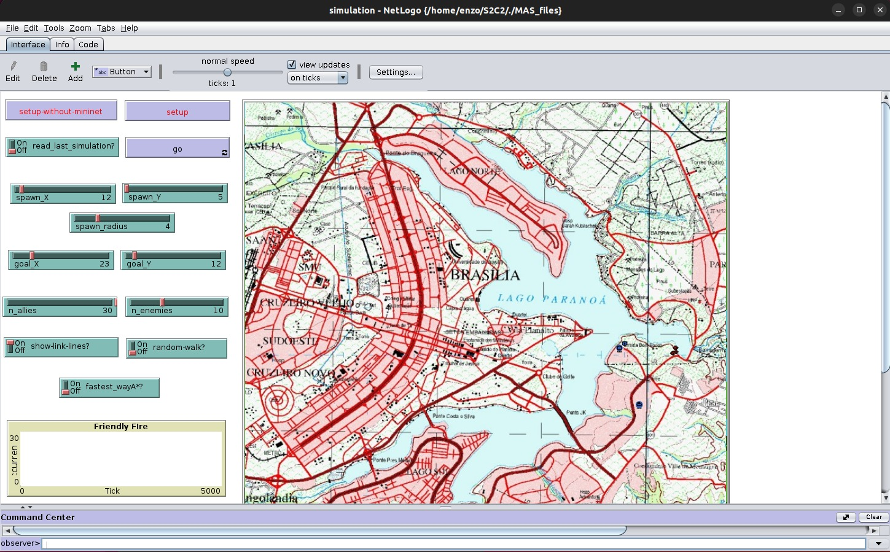
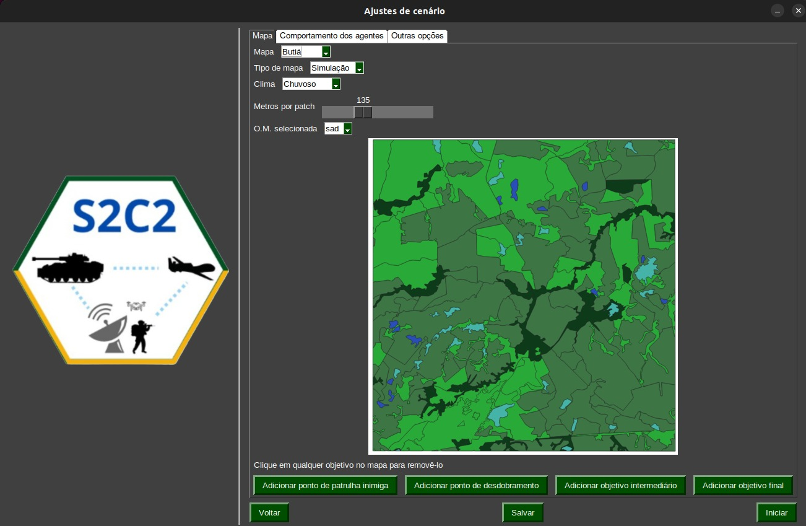
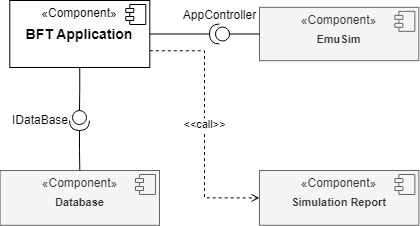
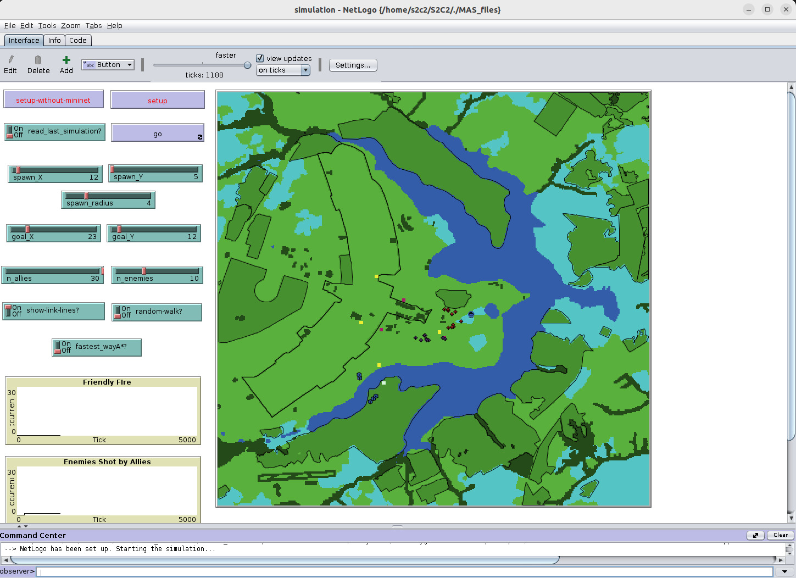
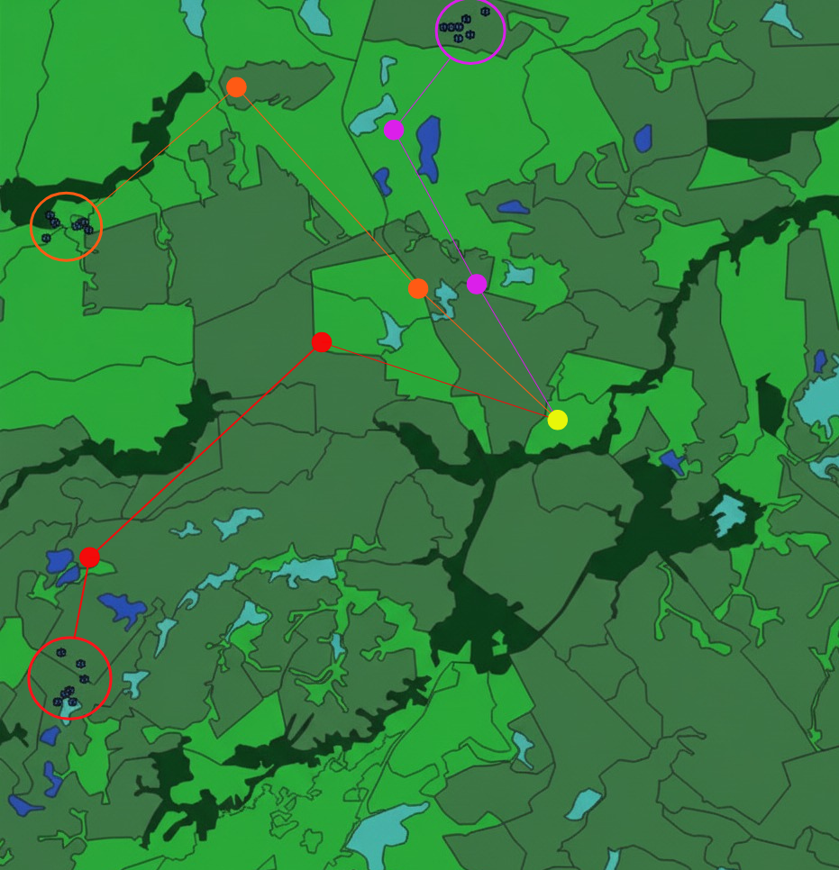
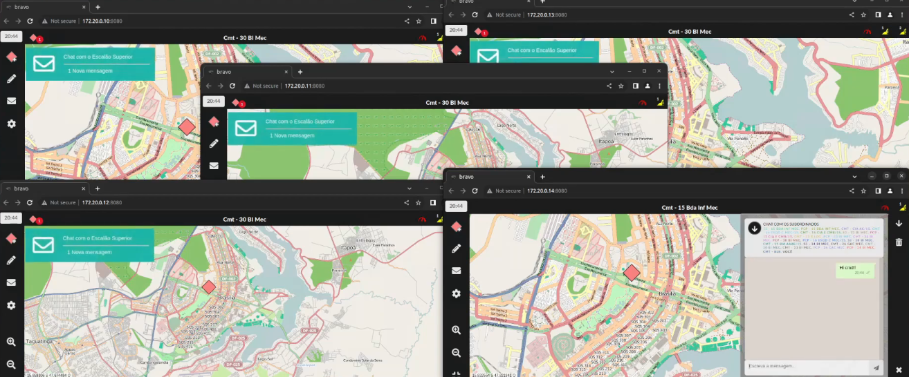

# <strong> 1. INTRODUÇÃO </strong> {#sec:01}

O desenvolvimento de uma rede de comunicação capaz de atender às necessidades das aplicações da Família de Aplicativos de Comando e Controle da Força Terrestre (FAC2FTer) envolve explorar diferentes alternativas de projeto para garantir eficiência na troca de dados entre tropas em variados cenários operacionais. Essas soluções devem representar com fidelidade o contexto militar, incluindo movimentação e posicionamento de unidades.

Com a evolução das aplicações de comando e controle e os investimentos do Exército Brasileiro em novos rádios táticos e no projeto de Rádio Definido por Software (RDS), torna-se essencial aprimorar protocolos e funcionalidades que suportem comunicações mais robustas. Nesse contexto, simulações que reproduzem o comportamento das tropas e o fluxo típico de informações em operações militares tornam-se ferramentas fundamentais para orientar o desenvolvimento dessas capacidades.

Este documento apresenta a visão geral do Sistema de Simulação no âmbito do projeto Sistema de Sistemas de Comando e Controle (S2C2), destacando sua arquitetura, seus principais componentes e o manual de utilização da ferramenta. O foco está nos módulos responsáveis pela simulação da rede de comunicação e pelo comportamento dos agentes que representam as tropas no ambiente simulado, bem como nas orientações para uso da solução desenvolvida.

# <strong>2. VISÃO ARQUITETURAL </strong> {#sec:02}

Para representar um ambiente operacional próximo ao real, adotou-se uma abordagem integrada que combina um Simulador de Sistema Multiagente (MAS) com um Emulador de Rede. Essa combinação permite modelar tanto o comportamento das tropas quanto os desafios de comunicação característicos de cenários militares. A Figura 1 apresenta a arquitetura geral do sistema S2C2 EmuSim, responsável por configurar e orquestrar as simulações.

O sistema é composto por módulos que se complementam. A interface gráfica (GUI) e o componente lógico S2C2 permitem ao operador criar, carregar e gerenciar cenários de simulação. O conhecimento doutrinário militar é fornecido por uma ontologia externa em OWL, utilizada pelo OWL Manager para manter a consistência lógica dos cenários e apoiar a criação e edição de instâncias de simulação.

Parâmetros operacionais adicionais — como seleção do mapa, modo de execução e opções de visualização — são controlados pelo Parameters Manager, que repassa a configuração final ao orquestrador EmuSim. Este é o núcleo do sistema, responsável por coordenar a execução conjunta do Simulador MAS e do Emulador de Rede, garantindo a sincronização entre o comportamento dos agentes e o fluxo de comunicação.

A arquitetura também inclui um módulo de gerenciamento de dados, responsável por registrar resultados das simulações, manter o modelo de dados e interagir com a ontologia. Para análise e visualização, métricas e indicadores são disponibilizados por meio de dashboards integrados ao Grafana, permitindo observar o desempenho dos cenários simulados.

# <strong>3. MODELAGEM DO SISTEMA </strong> {#sec:03}

Esta seção descreve como os principais componentes do S2C2 se organizam e contribuem para a execução das simulações, aprofundando a visão geral apresentada na Seção 2.

## <strong>3.1. Componentes GUI, S2C2 e OWL Manager </strong> {#sec:03.1}

A aplicação inicia pela **GUI**, responsável pela interação com o usuário. As ações realizadas na interface são encaminhadas ao componente **S2C2**, que concentra a lógica do sistema e coordena as operações internas.

O **OWL Manager** gerencia a ontologia *OWL IME S2C2 Base*, que define regras da doutrina militar utilizadas na construção dos cenários (tipos de agentes, restrições, parâmetros de comunicações etc.). A partir dessa ontologia:

* **OWL Create Instance** gera as instâncias do cenário.
* **OWL Update Instance** atualiza essas instâncias conforme alterações feitas pelo usuário.
* O **Parameters Manager** organiza e exibe os parâmetros disponíveis, respeitando as regras da ontologia.

## <strong>3.2. Componente EmuSim e suas Relações </strong> {#sec:03.2}

O **EmuSim** integra a simulação multiagente e a emulação de rede. Implementado em Python, ele sincroniza o **Simulador MAS (NetLogo)** e o **Emulador de Redes (Mininet-WiFi)**, mantendo alinhados o movimento dos agentes e o comportamento das comunicações.

Durante a execução:

* O **NetLogo** controla os agentes e o ambiente do terreno.
* O **Mininet-WiFi** executa as aplicações C2 e simula enlaces de comunicação isolados.
* Interfaces como **PyNetLogo** e **MN_Wifi** permitem o envio contínuo de dados entre os sistemas.

Cada tropa simulada corresponde a uma estação virtual com sua própria pilha de rede. Os dados coletados são armazenados pelo **DataManager** para análise posterior.

## <strong>3.3. Modelagem dos Mapas e Ambiente de Simulação </strong> {#sec:03.3}

A modelagem dos mapas utiliza arquivos **Shapefile (SHP)** provenientes de bases oficiais, como o BDGEx. Esses arquivos são processados em SIG (ex.: QGIS) para gerar camadas compatíveis com o NetLogo.

A criação de novos cenários requer:

* filtragem das camadas vetoriais,
* definição do tamanho real do terreno,
* geração da imagem PNG,
* criação do arquivo de configuração do mapa.

A escolha do cenário é feita por um menu *dropdown* (Figura abaixo).

<figure id="fig:dropdown">

<figcaption>Dropdown para escolha de mapas.</figcaption>
</figure>

A simulação pode ocorrer:

1. **Sobre o mapa vetorial**, com interação direta com o grid;
2. **Sobre a imagem PNG**, privilegiando visualização.

<figure id="fig:mapa_netlogo">

<figcaption>Simulação com mapa vetorial.</figcaption>
</figure>

<figure id="fig:mapa_png">

<figcaption>Simulação com mapa PNG.</figcaption>
</figure>

### <strong>Granularidade </strong>

A granularidade do grid impacta o desempenho: patches muito pequenos aumentam significativamente o custo computacional. O sistema permite ajustar esse valor por meio de um controle deslizante (Figura abaixo), recalculando automaticamente as dimensões da grade.

<figure id="fig:patch_slider">

<figcaption>Ajuste de tamanho de patches.</figcaption>
</figure>

# <strong>4. MODELOS DE FLUXO DO SISTEMA </strong> {#sec:04}

Esta seção descreve os principais fluxos de operação do sistema, desde o funcionamento geral da aplicação até o comportamento dos agentes e a identificação de situações de fogo amigo. Embora o exemplo utilize a aplicação C2 *Blue Force Tracking (BFT)*, o sistema é genérico para qualquer aplicação C2.

## <strong>4.1. Fluxo Geral da Aplicação </strong> {#sec:04.1}

A Figura [8](#fig:8.simulatio.flow) apresenta o fluxo completo da execução:

1. O usuário inicia a simulação pela **GUI**, configurando os parâmetros.
2. O **S2C2 Menu** valida a configuração com base na doutrina militar definida no **OWL Manager** e dispara a execução no **EmuSim**.
3. O **EmuSim** inicializa o **Simulador MAS**.
4. O **EmuSim** inicializa o **Emulador de Redes**.
5. O **EmuSim** instancia a aplicação **BFT** dentro do Emulador de Redes.
6. A simulação entra em loop:

   * O **Simulador MAS** envia posições via *PyNetLogo*.
   * O **Emulador de Redes** recebe as atualizações via *MN_Wifi*.
   * A **BFT** recebe os dados via *MQTT* e devolve o processamento.
   * O **EmuSim** repassa essas informações ao MAS, incluindo eventos de fogo amigo.
   * Os resultados são armazenados pelo **DataManager**.
7. O **EmuSim** encerra o Emulador de Redes.
8. O **EmuSim** encerra o Simulador MAS, finalizando a execução.

<figure id="fig:8.simulatio.flow" data-latex-placement="!ht">

Fonte: os autores.

<figcaption>Fluxo de execução da simulação.</figcaption>
</figure>

## <strong>4.2. Modelagem do Sistema Multiagente </strong> {#sec:04.2}

A simulação ocorre em um mapa 2D $N \times M$, composto por patches $p_{x,y}$. O usuário pode configurar geografia, número de unidades, posições iniciais e finais e pontos de controle.

A Figura [9](#fig:4.simulation) ilustra um cenário típico:
30 agentes aliados (azuis) deslocam-se da base aliada (A) até o objetivo (C), passando por pontos de controle (B) e enfrentando 10 agentes inimigos (vermelhos).

<figure id="fig:4.simulation" data-latex-placement="ht">

Fonte: os autores.

<figcaption>Simulação com agentes aliados e inimigos.</figcaption>
</figure>

### <strong>Navegação com A* </strong>

Aliados e inimigos utilizam o algoritmo **A***. A função de avaliação é:

[
f(a_i) = c_{a_i} + h_{a_i}
]

A função de custo soma os pesos dos patches até o destino:

[
c_{a_i}=\sum_{g}^{pos}(p_{x,y} \times w_{p_{x,y}})
]

Pesos do terreno:

* planícies (1)
* áreas alagadas (2)
* média elevação (3)
* intransponíveis (4)

A heurística é a distância Euclidiana até o objetivo.

---

## <strong>4.3. Modelagem de Estados dos Agentes </strong> {#sec:04.3}

As unidades mudam de cor conforme seu estado:
**Saudável**, **Ferido**, **Assistência médica urgente**, **Morto**.

Esses estados são definidos por uma **Máquina de Estados Finitos (FSM)**, mostrada na Figura [10](#fig:5.fsm). O estado inicial é *Saudável*, e os estados finais são *Assistência médica urgente* e *Morto*, alinhados às regras da Convenção de Genebra.

<figure id="fig:5.fsm" data-latex-placement="ht">

Fonte: os autores.

<figcaption>FSM dos estados dos agentes.</figcaption>
</figure>

### <strong>Transições de Estado por Ataque </strong>

A cada ataque, um valor aleatório ( d ) determina a transição:

* ( d > 0.8 ): não há ataque.
* ( d \leq 0.8 ): o atacante dispara.

A probabilidade de acerto depende da função de **precisão**, influenciada pela distância e alcance da arma, sempre com ( precisao(atq) \leq 0.8 ).

Para um agente *Saudável*:

* ( d > precisao(atq) ): erra → permanece *Saudável*
* ( 0.25 \le d \le precisao(atq) ): acerto leve → *Ferido*
* ( 0.25 < d \le 0.5 ): acerto grave → *Assistência médica urgente*
* ( 0.5 < d \le 0.8 ): acerto crítico → *Morto*

A identificação correta de aliados é fundamental para evitar **fogo amigo**, discutido na próxima seção.

# <strong>5. APLICAÇÕES DE S2C2 — Versão Resumida e Simplificada </strong>

Ao longo do projeto foram desenvolvidas diferentes aplicações para avaliar o desempenho do simulador S2C2. Estas aplicações permitem observar como a comunicação, o movimento das unidades e as condições do terreno influenciam o comportamento geral do sistema em cenários operacionais.

## <strong>5.1. Modelos de Dados da Aplicação </strong>

Para organizar as informações trocadas durante a simulação, o sistema utiliza três conjuntos principais de dados:

* **Mensagens** — registram tentativas e sucessos de comunicação.
* **Posições** — acompanham o deslocamento das unidades militares.
* **Colinas** — representam elevações do terreno que podem interferir na comunicação.

Esses dados são usados pelo simulador e pelo emulador para calcular deslocamentos, avaliar conectividade e determinar impactos do terreno.

## <strong>5.2. Modelagem de Ocorrências de Fogo Amigo </strong>

A simulação também inclui um modelo para analisar situações de **fogo amigo**, isto é, quando unidades aliadas atacam outras unidades amigas por falha de identificação.
Quando a identificação visual não é suficiente, as unidades dependem das informações fornecidas pelo **sistema BFT (Blue Force Tracking)**.

A troca de dados BFT entre as unidades é afetada por obstáculos, distância e qualidade da rede. Quando essas informações chegam de forma parcial ou não chegam, aumenta-se o risco de engano. A Figura abaixo ilustra a visualização dessas conexões durante a simulação.

*Monitoramento da comunicação entre unidades aliadas*

O modelo inclui regras gerais para determinar quando uma unidade decide atacar e como ocorre a classificação de cada disparo como “inimigo atingido” ou “fogo amigo”.

## <strong>5.3. Blue Force Tracking (BFT) </strong>

Para analisar mais profundamente os impactos na identificação entre unidades aliadas, foi criada uma aplicação BFT executada diretamente em cada nó do Emulador de Redes.
A aplicação opera de forma distribuída, enviando e recebendo informações de localização entre as unidades e repassando esses dados ao simulador para atualizar o cenário.

O BFT é composto por módulos responsáveis por:

* **Troca de dados com o simulador (via MQTT)**
* **Envio e recebimento de mensagens entre unidades**
* **Configuração da aplicação (como portas e parâmetros de retransmissão)**
* **Registro dos dados transmitidos**

A arquitetura geral e a interação com o simulador são mostradas nas figuras abaixo:

*Componentes do BFT*

*Interação do BFT com o Simulador*

Ao final da simulação, o BFT gera um relatório com estatísticas de fogo amigo, permitindo avaliar o impacto das condições de comunicação e do terreno no desempenho das unidades aliadas.

# <strong>6. Cenários de Testes e Resultados</strong> {#sec:06}

Diversos cenários de simulação foram executados ao longo do projeto para avaliar o desempenho das aplicações de comando e controle em diferentes contextos operacionais. As Figuras 16 e 17 ilustram algumas dessas execuções realizadas no laboratório S2C2.

<figure id="fig:10b.simulation" data-latex-placement="!ht">

<figcaption>Diferentes cenários em execução no laboratório S2C2.</figcaption>
</figure>

<figure id="fig:10c.simulation" data-latex-placement="!ht">

<figcaption>Simulação de ataque no ambiente do simulador.</figcaption>
</figure>

Dois cenários principais foram analisados para avaliar o impacto da comunicação entre unidades aliadas — um sem inimigos e outro com presença inimiga — permitindo comparar o efeito dessas condições na ocorrência de fogo amigo.

## <strong>6.1. Cenário BFT 01: Ausência de inimigos </strong>

O primeiro cenário (Figura 18) simula 21 unidades aliadas distribuídas em três grupos, deslocando-se por um conjunto de pontos intermediários até seus destinos.

<figure id="fig:10.simulation" data-latex-placement="!ht">

<figcaption>Cenário BFT em análise.</figcaption>
</figure>

Foram realizadas 43 execuções para cada um dos seis intervalos de comunicação avaliados (30 a 180 ticks). Sem inimigos no ambiente, os incidentes de fogo amigo decorrem exclusivamente de falhas na troca de informação entre unidades — seja por limitação de alcance, mudanças topológicas ou atrasos na comunicação.

Os resultados estão sintetizados no gráfico da Figura 19.

<figure id="fig:11.ff_progression" data-latex-placement="h!t!">

<figcaption>Redução do fogo amigo com melhoria na comunicação BFT.</figcaption>
</figure>

De forma geral, intervalos menores de comunicação reduzem significativamente o fogo amigo. Entretanto, a relação não é linear: variações locais no posicionamento das tropas podem criar zonas temporárias de maior ou menor conectividade, como observado nos intervalos T120 e T150.

## <strong>6.2. Cenário BFT 02: Presença de inimigos </strong>

No segundo cenário, unidades inimigas são introduzidas para avaliar o impacto da detecção e identificação no comportamento das tropas aliadas. A inclusão dos inimigos afeta diretamente o tráfego de mensagens, o nível de cautela das unidades e a probabilidade de classificações equivocadas, ampliando a complexidade da simulação.

## <strong>6.3. Cenário GCB</strong>

O cenário com o GCB integrou sua aplicação ao modelo BFT, permitindo a troca de informações entre as estações e oferecendo suporte adicional ao processo de decisão do comandante.

A Figura 20 mostra a execução integrada com cinco estações GCB.

<figure id="fig:S2C2-CGB01" data-latex-placement="!ht">

<figcaption>Inicialização das estações GCB durante o cenário.</figcaption>
</figure>

A Figura 21 ilustra a entrada de um novo nó, inicialmente classificado como inimigo por falta de identificação.

<figure id="fig:S2C2-CGB02" data-latex-placement="!ht">

<figcaption>Inserção de novo nó e reação das demais unidades.</figcaption>
</figure>

Após o estabelecimento da comunicação, o nó é incorporado corretamente à estrutura hierárquica (Figura 22).

<figure id="fig:S2C2-CGB03" data-latex-placement="!ht">

<figcaption>Reconhecimento do novo nó após troca de mensagens.</figcaption>
</figure>

---

## <strong>6.4. Cenário BRAVO (Extensão do Projeto S2C2)</strong>

O cenário BRAVO amplia os testes anteriores, incorporando novos perfis de unidades, ajustes na comunicação e maior variação nos elementos operacionais. Ele funciona como um desdobramento natural das capacidades demonstradas nos cenários BFT e GCB.

# <strong>7. PUBLICAÇÕES GERADAS</strong> {#sec:07}

- CARVALHO, Leonardo Filipe Batista Silva de; DE SOUZA, Vitor Simon;
  BONATTO, Alisson Nunes; PEREZ, Thales Junqueira Albergaria Moraes; DE
  FREITAS, Edison Pignaton; BARONE, Dante Augusto Couto; ZIBETTI,
  Guilherme Rotth; DOS ANJOS, Julio C. S.; DE ARAUJO FERNANDES, Ricardo
  Queiroz. Multi-Agent Systems Modeling of Command and Control Systems:
  A Metrics-Driven Approach to Simulator Evaluation and Co-Simulation.
  Journal of Simulation, \[S. l.\], no prelo, 2025. DOI:
  10.1080/17477778.2025.2584542.

- GOMES, João Eduardo Costa; EHLERT, Ricardo Rodrigues; BOESCHE, Rodrigo
  Murillo; SANTOS DE LIMA, Vinicius; STOCCHERO, Jorgito Matiuzzi;
  BARONE, Dante Augusto Couto; WICKBOLDT, Juliano Araujo; FREITAS,
  Edison Pignaton de; ANJOS, Julio C. S. dos; ARAUJO FERNANDES, Ricardo
  Queiroz de. Surveying emerging network approaches for military command
  and control systems. ACM Computing Surveys, v. 56, p. 1--38, 2024.

- CARVALHO, Leonardo Filipe Batista Silva de; SOUZA, Vitor Simon de;
  BONATTO, Alisson Nunes; PEREZ, Thales Junqueira Albergaria Moraes;
  FREITAS, Edison Pignaton de; BARONE, Dante Augusto Couto; ZIBETTI,
  Guilherme Rotth; ANJOS, Julio C. S. dos; ARAUJO FERNANDES, Ricardo
  Queiroz de. A multi-agent system approach for Blue Force Tracking C2
  application modeling. In: Lecture Notes in Networks and Systems. 1.
  ed. Cham: Springer Nature Switzerland, 2024. v. 2, p. 161--181.

- BARONE, Dante A. C. et al. Integrated multi-agent system simulator and
  network emulator framework to realistically exercise networked command
  and control application scenarios. In: INTERNATIONAL CONFERENCE ON
  SIMULATION AND MODELING METHODOLOGIES, TECHNOLOGIES AND APPLICATIONS,
  2023, Cham. Proceedings\... Cham: Springer Nature
  Switzerland, 2023. p. 9--28.

- BARONE, Dante Augusto Couto; WICKBOLDT, Juliano Araujo; CAVALCANTI,
  Maria Cristina Rosa; MOURA, David; TESOLIN, Julio Cesar Costa; DEMORI,
  André Marques; ANJOS, Julio C. dos; CARVALHO, Leonardo Filipe Batista
  Silva de; GOMES, João Eduardo Costa; FREITAS, Edison Pignaton de.
  Integrating a multi-agent system simulator and a network emulator to
  realistically exercise military network scenarios. In: INTERNATIONAL
  CONFERENCE ON SIMULATION AND MODELING METHODOLOGIES, TECHNOLOGIES AND
  APPLICATIONS (SIMULTECH 2023), 13., 2023, Roma. Proceedings\...
  Roma, 2023. p. 194--201.

- DEMORI, André; TESOLIN, Julio; MOURA, David; GOMES, João; PEDROSO,
  Gabriel; CARVALHO, Leonardo Silva de; FREITAS, Edison Pignaton de;
  CAVALCANTI, Maria. A semantic web approach for military operation
  scenarios development for simulation. In: INTERNATIONAL CONFERENCE ON
  DATA SCIENCE, TECHNOLOGY AND APPLICATIONS, 12., 2023, Rome.
  Proceedings\... Rome, 2023. p. 390.

# <strong>8. CONSIDERAÇÕES FINAIS</strong> {#sec:08}

Este relatório apresentou o simulador desenvolvido no projeto S2C2, voltado ao apoio no desenvolvimento de sistemas e aplicativos de Comando e Controle (C2). O simulador oferece um ambiente de co-simulação que permite testar protocolos de comunicação e sistemas táticos em condições próximas às operacionais.

Além do simulador, foram desenvolvidas aplicações descritas na Seção [5](#sec:05), todas voltadas à redução do fratricídio em cenários de batalha. Essas aplicações permitiram validar as funcionalidades do simulador e demonstrar sua utilidade na geração de métricas relevantes ao contexto militar. As principais contribuições incluem:

* **Simulador S2C2:** plataforma de co-simulação que integra sistemas táticos para execução de exercícios militares em ambiente controlado;
* **Aderência à doutrina militar:** conforme descrito nas Subsecões [4.2](#sec:04.2) e [5.2](#sec:04.3), foram implementados comportamentos alinhados à doutrina, reforçando a fidelidade dos cenários;
* **Validação baseada em métricas:** a aplicação BFT permitiu avaliar o impacto de diferentes parâmetros de configuração sobre o desempenho da operação, apoiando a decisão de tiro com dados de C2.

Como continuidade, prevê-se ampliar o simulador para interação com a Família de Aplicativos de Comando e Controle da Força Terrestre (FAC2FTer) e criar novos cenários para apoiar equipes de desenvolvimento, testes e homologação de sistemas C2.

Também está prevista a adaptação do **Blue Force Tracking (BFT)** para execução em contêineres controlados pelo Emulador de Rede, onde cada contêiner instanciará os módulos `Client` e `Server` utilizando sua pilha de rede isolada para comunicação.

Por fim, o Apêndice [[appen:a]](#appen:a) apresenta o manual de operação do simulador, e o Apêndice [[appen:b]](#appen:b) contém o relatório de um cenário executando o BFT.