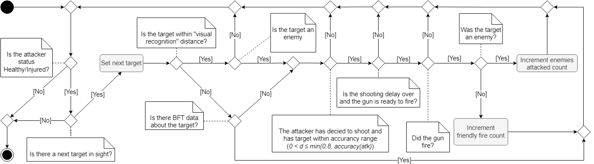

# INTRODUÇÃO {#sec-01}

O desenvolvimento de uma rede de comunicação capaz de atender às necessidades das aplicações da Família de Aplicativos de Comando e Controle da Força Terrestre (FAC2FTer) envolve explorar diferentes alternativas de projeto para garantir eficiência na troca de dados entre tropas em variados cenários operacionais. Essas soluções devem representar com fidelidade o contexto militar, incluindo movimentação e posicionamento de unidades.

Com a evolução das aplicações de comando e controle e os investimentos do Exército Brasileiro em novos rádios táticos e no projeto de Rádio Definido por Software (RDS), torna-se essencial aprimorar protocolos e funcionalidades que suportem comunicações mais robustas. Nesse contexto, simulações que reproduzem o comportamento das tropas e o fluxo típico de informações em operações militares tornam-se ferramentas fundamentais para orientar o desenvolvimento dessas capacidades.

Este documento apresenta a visão geral do Sistema de Simulação no âmbito do projeto Sistema de Sistemas de Comando e Controle (S2C2), destacando sua arquitetura, seus principais componentes e o manual de utilização da ferramenta. O foco está nos módulos responsáveis pela simulação da rede de comunicação e pelo comportamento dos agentes que representam as tropas no ambiente simulado, bem como nas orientações para uso da solução desenvolvida.

# VISÃO ARQUITETURAL {#sec-02}

Para representar um ambiente operacional próximo ao real, adotou-se uma abordagem integrada que combina um Simulador de Sistema Multiagente (MAS) com um Emulador de Rede. Essa combinação permite modelar tanto o comportamento das tropas quanto os desafios de comunicação característicos de cenários militares. A Figura 1 apresenta a arquitetura geral do sistema S2C2 EmuSim, responsável por configurar e orquestrar as simulações.

O sistema é composto por módulos que se complementam. A interface gráfica (GUI) e o componente lógico S2C2 permitem ao operador criar, carregar e gerenciar cenários de simulação. O conhecimento doutrinário militar é fornecido por uma ontologia externa em OWL, utilizada pelo OWL Manager para manter a consistência lógica dos cenários e apoiar a criação e edição de instâncias de simulação.

Parâmetros operacionais adicionais — como seleção do mapa, modo de execução e opções de visualização — são controlados pelo Parameters Manager, que repassa a configuração final ao orquestrador EmuSim. Este é o núcleo do sistema, responsável por coordenar a execução conjunta do Simulador MAS e do Emulador de Rede, garantindo a sincronização entre o comportamento dos agentes e o fluxo de comunicação.

A arquitetura também inclui um módulo de gerenciamento de dados, responsável por registrar resultados das simulações, manter o modelo de dados e interagir com a ontologia. Para análise e visualização, métricas e indicadores são disponibilizados por meio de dashboards integrados ao Grafana, permitindo observar o desempenho dos cenários simulados.

## Modelagem do Sistema {#sec-03}

Esta seção descreve como os principais componentes do S2C2 se organizam e contribuem para a execução das simulações, aprofundando a visão geral apresentada na Seção 2.

## Componentes GUI, S2C2 e OWL Manager {#subsec-03-1}

A aplicação inicia pela GUI, responsável pela interação com o usuário. As ações realizadas na interface são encaminhadas ao componente S2C2, que concentra a lógica do sistema e coordena as operações internas.

O OWL Manager gerencia a ontologia OWL IME S2C2 Base, que define regras da doutrina militar utilizadas na construção dos cenários (tipos de agentes, restrições, parâmetros de comunicações etc.). A partir dessa ontologia:

OWL Create Instance gera as instâncias do cenário.

OWL Update Instance atualiza essas instâncias conforme alterações feitas pelo usuário.

O Parameters Manager organiza e exibe os parâmetros disponíveis, respeitando as regras da ontologia.

## 3.2 Componente EmuSim e suas Relações {#subsec-03-2}

O EmuSim integra a simulação multiagente e a emulação de rede. Implementado em Python, ele sincroniza o Simulador MAS (NetLogo) e o Emulador de Redes (Mininet-WiFi), mantendo alinhados o movimento dos agentes e o comportamento das comunicações.

Durante a execução:

O NetLogo controla os agentes e o ambiente do terreno.

O Mininet-WiFi executa as aplicações C2 e simula enlaces de comunicação isolados.

Interfaces como PyNetLogo e MN_Wifi permitem o envio contínuo de dados entre os sistemas.

Cada tropa simulada corresponde a uma estação virtual com sua própria pilha de rede. Os dados coletados são armazenados pelo DataManager para análise posterior.

## 3.3 Modelagem dos Mapas e Ambiente de Simulação {#subsec-03-3}

A modelagem dos mapas utiliza arquivos Shapefile (SHP) provenientes de bases oficiais, como o BDGEx. Esses arquivos são processados em SIG (ex.: QGIS) para gerar camadas compatíveis com o NetLogo.

A criação de novos cenários requer:

filtragem das camadas vetoriais,

definição do tamanho real do terreno,

geração da imagem PNG,

criação do arquivo de configuração do mapa.

A escolha do cenário é feita por um menu dropdown (Figura abaixo).

<figure id="fig:dropdown"> 

 <figcaption>Dropdown para escolha de mapas.</figcaption> </figure>

A simulação pode ocorrer:

Sobre o mapa vetorial, com interação direta com o grid;

Sobre a imagem PNG, privilegiando visualização.

<figure id="fig:mapa_netlogo"> 

 <figcaption>Simulação com mapa vetorial.</figcaption> </figure> <figure id="fig:mapa_png"> 

 <figcaption>Simulação com mapa PNG.</figcaption> </figure>
Granularidade

A granularidade do grid impacta o desempenho: patches muito pequenos aumentam significativamente o custo computacional. O sistema permite ajustar esse valor por meio de um controle deslizante (Figura abaixo), recalculando automaticamente as dimensões da grade.

<figure id="fig:patch_slider"> 

 <figcaption>Ajuste de tamanho de patches.</figcaption> </figure>

Aqui está uma **versão mais enxuta**, mantendo clareza, estrutura e o essencial do conteúdo técnico.

---

# Modelos de Fluxo do Sistema {#sec-04}**

Esta seção descreve os principais fluxos de operação do sistema, desde o funcionamento geral da aplicação até o comportamento dos agentes e a identificação de situações de fogo amigo. Embora o exemplo utilize a aplicação C2 *Blue Force Tracking (BFT)*, o sistema é genérico para qualquer aplicação C2.

---

## Fluxo Geral da Aplicação {#sec-04.1}**

A Figura [8](#fig:8.simulatio.flow) apresenta o fluxo completo da execução:

1. O usuário inicia a simulação pela **GUI**, configurando os parâmetros.
2. O **S2C2 Menu** valida a configuração com base na doutrina militar definida no **OWL Manager** e dispara a execução no **EmuSim**.
3. O **EmuSim** inicializa o **Simulador MAS**.
4. O **EmuSim** inicializa o **Emulador de Redes**.
5. O **EmuSim** instancia a aplicação **BFT** dentro do Emulador de Redes.
6. A simulação entra em loop:

   * O **Simulador MAS** envia posições via *PyNetLogo*.
   * O **Emulador de Redes** recebe as atualizações via *MN_Wifi*.
   * A **BFT** recebe os dados via *MQTT* e devolve o processamento.
   * O **EmuSim** repassa essas informações ao MAS, incluindo eventos de fogo amigo.
   * Os resultados são armazenados pelo **DataManager**.
7. O **EmuSim** encerra o Emulador de Redes.
8. O **EmuSim** encerra o Simulador MAS, finalizando a execução.

<figure id="fig:8.simulatio.flow" data-latex-placement="!ht">

Fonte: os autores.

<figcaption>Fluxo de execução da simulação.</figcaption>
</figure>

---

## **4.2 Modelagem do Sistema Multiagente {#sec-04.2}**

A simulação ocorre em um mapa 2D $N \times M$, composto por patches $p_{x,y}$. O usuário pode configurar geografia, número de unidades, posições iniciais e finais e pontos de controle.

A Figura [9](#fig:4.simulation) ilustra um cenário típico:
30 agentes aliados (azuis) deslocam-se da base aliada (A) até o objetivo (C), passando por pontos de controle (B) e enfrentando 10 agentes inimigos (vermelhos).

<figure id="fig:4.simulation" data-latex-placement="ht">

Fonte: os autores.

<figcaption>Simulação com agentes aliados e inimigos.</figcaption>
</figure>

### **Navegação com A***

Aliados e inimigos utilizam o algoritmo **A***. A função de avaliação é:

[
f(a_i) = c_{a_i} + h_{a_i}
]

A função de custo soma os pesos dos patches até o destino:

[
c_{a_i}=\sum_{g}^{pos}(p_{x,y} \times w_{p_{x,y}})
]

Pesos do terreno:

* planícies (1)
* áreas alagadas (2)
* média elevação (3)
* intransponíveis (4)

A heurística é a distância Euclidiana até o objetivo.

---

## **4.3 Modelagem de Estados dos Agentes {#sec-04.1.1}**

As unidades mudam de cor conforme seu estado:
**Saudável**, **Ferido**, **Assistência médica urgente**, **Morto**.

Esses estados são definidos por uma **Máquina de Estados Finitos (FSM)**, mostrada na Figura [10](#fig:5.fsm). O estado inicial é *Saudável*, e os estados finais são *Assistência médica urgente* e *Morto*, alinhados às regras da Convenção de Genebra.

<figure id="fig:5.fsm" data-latex-placement="ht">

Fonte: os autores.

<figcaption>FSM dos estados dos agentes.</figcaption>
</figure>

### **Transições de Estado por Ataque**

A cada ataque, um valor aleatório ( d ) determina a transição:

* ( d > 0.8 ): não há ataque.
* ( d \leq 0.8 ): o atacante dispara.

A probabilidade de acerto depende da função de **precisão**, influenciada pela distância e alcance da arma, sempre com ( precisao(atq) \leq 0.8 ).

Para um agente *Saudável*:

* ( d > precisao(atq) ): erra → permanece *Saudável*
* ( 0.25 \le d \le precisao(atq) ): acerto leve → *Ferido*
* ( 0.25 < d \le 0.5 ): acerto grave → *Assistência médica urgente*
* ( 0.5 < d \le 0.8 ): acerto crítico → *Morto*

A identificação correta de aliados é fundamental para evitar **fogo amigo**, discutido na próxima seção.

---

Se quiser, posso **reduzir ainda mais**, **simplificar a redação**, ou **formatar como texto científico ABNT**.

# APLICAÇÕES DE S2C2 {#sec-05}

Para analisar o desempenho do simulador, desenvolveram-se diferentes
aplicações de S2C2 ao longo do projeto. Estas aplicaçãoes e os
resultados obtidos a partir das mesmas são discutidas a seguir.

## Modelos de Dados da Aplicação {#subsec:3.3}

Para melhor organizar as informações geradas pela simulação, bem como,
para facilitar futuras consultas a dados e a execução em tempo real,
foram criados diferentes conjuntos de dados para a troca de informações
entre agentes do sistema, simulador e emulador. Estes conjuntos são
divididos em Mensagens, Posições e Colinas.

- Mensagens: registra tentativas de comunicação e comunicações
  bem-sucedidas.

- Posições: registra o log da trajetória seguida por cada unidade.

- Colinas: registra a presença de elevações do terreno (colinas) que
  possam interferir na comunicação entre pares de unidades durante a
  simulação.

### Posições

O conjunto de dados Posições identifica os agentes individuais do
sistema multiagentes do simulador, cada um representando uma unidade
militar. Estes dados são gerados e processados pelo NetLogo para
questões de deslocamento das unidades, e utilizados pelo Mininet Wi-fi
para avaliar as chances de sucesso ou falha de comunicações. Os
seguintes campos compõem o conjunto Posições.

- node: tipo inteiro. Indica o nó ao qual as informações se referem.

- x: tipo float. Indica a coordenada x da unidade referida no nó.

- y: tipo float. Indica a coordenada y da unidade referida no nó.

- tick: tipo inteiro. Indica o momento (em ticks) dos dados.

- round_id: tipo inteiro. Indica o número do ciclo atual.

### Colinas

O conjunto de dados Colinas identifica o nível de transposição de cada
patch individual do mapa da simulação, sendo um patch uma célula
individual que pode ser ocupada por um agente. Os dados do conjunto
impactam tanto o algoritmo de deslocamento dos agentes no NetLogo, como
o nível de sucesso de entrega do envio de comunicações de rádio entre as
unidades militares no Mininet Wi-fi. Os seguintes campos compõem o
conjunto Colinas.

- nodea: tipo inteiro. Indica um dos nós do par analisado.

- nodeb: tipo inteiro. Indica o outro nó do par analisado.

- hill: tipo inteiro. Indica o nível de interferência entre o par de
  nós.

- tick: tipo inteiro. Indica o momento (em ticks) das informações.

- round_id: tipo inteiro. Indica o número da rodada atual.

## Modelagem de ocorrências de Fogo Amigo {#sec-04.3}

A comunicação é um recurso vital para os soldados. O reconhecimento
visual permite que as unidades militares, dentro de uma distância reta
máxima, identifiquem aliados sem depender de comunicações por rede. No
entanto, além desse limite ou quando na presença de obstáculos visuais,
o uso de communicação por rede é essencial para identificar unidades
amigas.

Situações de fogo amigo ocorrem justamente quando uma unidade militar é
incapaz de identificar outra unidade como aliada e a ataca por engano.
Para monitorar e evitar esses incidentes, a aplicação desenvolvida
utiliza um sistema BFT, um tipo de sistema conhecido por empregar
dispositivos GPS para rastrear e exibir as posições de forças aliadas
(azuis) no campo de batalha. Esse sistema aprimora a consciência
situacional e facilita as comunicações de comando e controle entre
unidades dispersas [@sweeney2008blue; @chevli2006blue].

A eficácia da aplicação BFT depende de uma comunicação de rede robusta
para identificar aliados com precisão. Interrupções na rede,
frequentemente causadas por obstáculos no campo de batalha, como
terrenos elevados, podem gerar dados BFT incompletos ou a total perda da
informação, assim, aumentando o risco de fogo amigo. Equipes militares
geralmente preveem esses obstáculos por meio de missões de
reconhecimento de terreno, característica que reforça a escolha do
algoritmo A\* para a simulação do movimento das unidades. Para este
sistema, a aplicação BFT foi construída como um modulo dentro do
componente *Emulador de Redes*, no caso, o Mininet Wi-fi, sendo acionado
junto com o início da simulação de acordo com o fluxo do diagrama de
sequência da Figura [11](#fig:9.diagrama.bft){reference-type="ref"
reference="fig:9.diagrama.bft"}.

<figure id="fig:9.diagrama.bft" data-latex-placement="ht">

 

Fonte: os autores.

<figcaption>Diagrama de sequência da aplicação BFT.</figcaption>
</figure>

De acordo com o diagrama da aplicação BFT, cada nó $i$, que simula uma
unidade militar, possui uma aplicação cliente-servidor. A cada tick do
ambiente de simulação, o nó $i$ recebe uma mensagem do ambiente
ordenando que avance pelo mapa do cenário. Após receber essa mensagem, o
cliente do nó $i$ envia uma nova mensagem com seus dados de localização
para todos o nó $n$ da população de agentes $P$ próximo a ele, assumindo
que $\exists n \in P | n \neq i \wedge (0 \leq n < P)$. Igualmente, todo
nó $n$ da aplicação que recebe esta nova mensagem a reencaminha para
todo nó $m$ próximo a ele, de forma que
$\exists m \in P | m \neq i \wedge m \neq n \wedge (0 \leq m < P)$.

Em paralelo a isso, todo nó $i$ da simulação que recebe uma mensagem de
outro nó $k$ qualquer em sua aplicação servidor envia para sua interface
MQTT os dados de localização recebidos deste nó $k$, junto com seu
próprio identificador, a informação de data e hora do recebimento dessa
informação e o identificador do tick atual. Ao final, a interface MQTT
do nó $i$ devolve para o ambiente da aplicação os dados de localização
do nó $k$, que utiliza essas informações para atualizar o cenário da
simulação.

O modelo BFT construído assume que, no início da simulação, os agentes
aliados compartilham informações mútuas, permitindo a troca de dados
BFT, que é ilustrada pelas linhas brancas na
Figura [12](#fig:6.simulation.lines){reference-type="ref"
reference="fig:6.simulation.lines"}. No entanto, obstáculos no terreno,
assim como interrupções na rede, podem levar a perda parcial de
comunicação, de forma que apenas um dos agentes conectados possui dados
BFT sobre o outro (ilustrado pela linha laranja ligando os agentes em
questão), ou a perda completa de comunicação (reresentada pela ausência
de linha conectando os agentes).

<figure id="fig:6.simulation.lines" data-latex-placement="!h!t">

 

Fonte: os autores.

<figcaption>Monitoramento de comunicação entre unidades
aliadas.</figcaption>
</figure>

Unidades aliadas e inimigas disparam automaticamente contra unidades não
identificadas dentro de seu campo de visão. Além do campo de visão ---
em formato de cone --- a precisão do disparo também considera o alcance
efetivo da arma portada pelo agente. A cada segundo, o MAS escaneia o
cenário de batalha, iterando sobre os agentes e registrando, para cada
um, todas as unidades dentro do seu campo de visão que atendem às
condições de ataque e não se encontram em um estado final da FSM.

Por outro lado, conforme requisitado pelos stakeholders, as unidades
inimigas seguem um comportamento de ataque simplificado: elas nunca
causam fogo amigo e sempre disparam contra unidades aliadas dentro do
seu alcance de precisão.

Isso contrasta com as unidades aliadas, que seguem um processo decisório
mais complexo, detalhado no diagrama de atividades [@OMG2017] da
Figura [13](#fig:7.friendly.fire){reference-type="ref"
reference="fig:7.friendly.fire"}. Esse modelo trata cada agente $a_{i}$
como um possível atacante direcionado a outros agentes. Contudo, tanto
unidades inimigas quanto aliadas estão sujeitas a erros de disparo.

<figure id="fig:7.friendly.fire" data-latex-placement="!h!t">

 

Fonte: os autores.

<figcaption>Fluxo de ataque e fogo amigo entre unidades
aliadas.</figcaption>
</figure>

A confirmação de um alvo segue condições específicas --- apresentadas no
diagrama da Figura [13](#fig:7.friendly.fire){reference-type="ref"
reference="fig:7.friendly.fire"} e listadas a seguir. Esse processo é
repetido para cada agente aliado com status válido na simulação,
considerando todas as combinações possíveis entre agentes atacante e
alvo, até a conclusão da simulação.

- Atacante e alvo não se encontram em um estado final.

- A distância em linha reta entre o atacante e o alvo está fora da
  distância de "reconhecimento visual", exigindo o feedback da aplicação
  BFT para identificação mútua.

- O atacante não recebeu da rede BFT comunicação de retorno do alvo.

- O atacante decidiu atirar e tem o alvo dentro do campo de visão e
  alcance da arma $(0<d \leq \text{min}(0.8, precisao(atq)))$.

- A unidade atacante respeita um atraso de, pelo menos, 6 segundos entre
  a visualização do alvo e o disparo. Tempo requisitado pelos
  stakeholders com base nos tempos médios para a tomada de decisão de
  disparo por soldados.

- A arma está pronta para disparar, sem restrições em vigor, como o
  tempo entre os disparos ou necessidade de recarga.

Quando todas as condições são atendidas, o atacante realiza o disparo.
Se tanto o atacante quanto o alvo forem unidades aliadas,
independentemente de o tiro acertar, o algoritmo incrementa a contagem
de "fogo amigo". Caso o alvo seja inimigo, a contagem de "inimigo
atacado" é aumentada.

## Blue Force Tracking {#subsec:5.3}

Para analisar o desempenho do simulador, conforme descrito na Seção 4.3,
foi criada a aplicação **Blue Force Tracking (BFT)**. Essa aplicação é
executada em cada nó controlado pelo **Emulador de Rede**. Em cada nó
rodam os módulos `Client` e `Server` do BFT, que utilizam a pilha de
rede isolada do respectivo *namespace* --- ou seja, o conjunto de
protocolos e interfaces de rede independentes daquele nó --- para se
comunicarem. Nesta seção, são apresentados os principais componentes do
BFT, ilustrados na Figura [14](#fig:a.diagrama.bft){reference-type="ref"
reference="fig:a.diagrama.bft"}.

<figure id="fig:a.diagrama.bft" data-latex-placement="ht">

 

Fonte: os autores.

<figcaption>Diagrama de Componentes da Aplicação Blue Force
Tracking.</figcaption>
</figure>

### MQTT Interface

O componente MQTT interface fornece uma interface para a troca de dados
entre o orquestrador da simulação e a aplicação BFT que executa dentro
de cada agente simulados do cenário de campo de batalha.

### Client

O componente Client define a interface de envio de dados da aplicação
através de pacotes UDP.

### Server

O componente Server define a inferface para recebimento de dados da
aplicação oriundo de outros agentes, pacotes UDP.

### Configuration

O componente Configuration contém informações de configuração da
aplicação, como o as portas utilizadas pelos componentes Client e
Server, as portas utilizadas para o MQTT, entre outras configuraçõs de
rede. Também no componente Configuration é especificado o ttl, um
inteiro que define o número de vezes que uma mensagem recebida por um
agente será retransmitida para os demais agentes no seu alcance de
comunicação. Este parâmetro visa ampliar a área de cobertura do BFT.

### Data

O componente Data define o modelo de dados da aplicação BFT, composto
por:

- source_ip: endereço de IP de origem;

- receiver_ip: endereço IP de destino;

- tick_sent: inteiro indicando o momento (em ticks) a que as informações
  se referem.

- position_x: float indicando a coordenada $x$ do agente.

- position_y: float indicando a coordenada $y$ do agente.

O diagrama representado na Figura [15](#fig:b.bft){reference-type="ref"
reference="fig:b.bft"} apresenta a comunicação da aplicação BFT com o
simulador S2C2 através das interfaces AppController e IDatabase, também
representadas na
Figura [1](#fig:1.arquitetura.s2c2){reference-type="ref"
reference="fig:1.arquitetura.s2c2"}.

<figure id="fig:b.bft" data-latex-placement="ht">

 

Fonte: os autores.

<figcaption>Interação do BFT com Simulador S2C2.</figcaption>
</figure>

Durante a simulação, a aplicação BFT troca mensagens de controle com o
orquestrador da simulação, o EmuSim, e armazena as mensagems trocadas no
banco de dados através da interface IDataBase. No final da simulação, a
aplicação BFT gera um relatório contendo as estatísticas de fogo amigo
do cenário de simulação executado, de modo a validar o impacto das
alterações no cenário de simulação no contexto do fogo amigo.

# CENÁRIOS DE TESTES E RESULTADOS {#sec-06}

Ao longo do projeto, diferentes cenários de simulação foram
desenvolvidos para representar as diversas necessidades apresentadas
pelas Forças Armadas. A
Figura [16](#fig:10b.simulation){reference-type="ref"
reference="fig:10b.simulation"} e a
Figura [17](#fig:10c.simulation){reference-type="ref"
reference="fig:10c.simulation"} mostram os computadores do laboratório
S2C2 executando alguns desses diferentes cenários.

<figure id="fig:10b.simulation" data-latex-placement="!ht">

 

Fonte: os autores.

<figcaption>Diferentes cenários de simulação em execução no laboratório
S2C2</figcaption>
</figure>

<figure id="fig:10c.simulation" data-latex-placement="!ht">

Fonte: os autores.

<figcaption>Simulação de ataque executando no simulador.</figcaption>
</figure>

A seguir, são detalhados dois cenários que melhor ilustram o progresso
obtido no desenvolvimento das simulações. Ambos compartilham as mesmas
características de mapa, tropas aliadas, parâmetros de comunicação e
condições climáticas, diferindo apenas quanto à presença ou ausência de
inimigos. Na sequência, é apresentado um comparativo entre as duas
propostas, a fim de compreender melhor como essa diferença afeta as
ocorrências de fogo amigo entre unidades aliadas.

## Cenário de Simulação BFT 01: Ausência de inimigos

O cenário de simulação analisado é apresentado na
Figura [18](#fig:10.simulation){reference-type="ref"
reference="fig:10.simulation"}. Esse cenário consiste em 21 unidades
aliadas de soldados a pé, divididas em três grupos de combate.

<figure id="fig:10.simulation" data-latex-placement="!ht">

Fonte: os autores.

<figcaption>Simulação de ataque sob análise.</figcaption>
</figure>

Para alcançar resultados estatisticamente consistentes entre as
configurações, foram realizadas 43 execuções de simulação por intervalo.
Este experimento foi conduzido com seis durações distintas de
comunicação --- 30, 60, 90, 120, 150 e 180 *ticks* (representando
aproximadamente um segundo do mundo real por *tick*) --- a fim de
explorar as complexidades da comunicação. Além disso, o período de
validade de cada mensagem foi definido como o dobro do respectivo
intervalo de comunicação (por exemplo, para um intervalo de comunicação
de 60 segundos, uma mensagem recebida por um aliado permanece válida por
120 segundos).

Para isolar melhor os resultados de fogo amigo do BFT, não foram
incluídas unidades inimigas para a execução desta primeira análise. Pelo
mesmo motivo, a simulação foi executada sob condições climáticas claras,
sem considerar falhas de equipamento ou recursos de guerra eletrônica.

As unidades aliadas navegam continuamente em direção aos destinos
designados, passando pelos pontos intermediários indicados pela cor do
círculo que destaca cada unidade na
Figura [18](#fig:10.simulation){reference-type="ref"
reference="fig:10.simulation"}, até alcançar o destino destacado em
amarelo. À medida que as tropas se deslocam pelo campo, as forças
aliadas podem passar pelas zonas de linha de visão, alcance de
comunicação e alcance de disparo. Elas classificam como aliados tanto as
unidades corretamente identificadas dentro de seu campo de visão quanto
aquelas que recebem com sucesso as informações transmitidas dentro do
período de validade. Qualquer unidade que não atenda a um desses
critérios é classificada como inimiga --- mesmo que o cenário simulado
não inclua entidades inimigas.

Entretanto, essa classificação permanece suscetível a mudanças
topológicas que podem afetar o campo de visão ou o alcance de ataque.
Tais mudanças também podem influenciar a taxa de sucesso na entrega de
mensagens pela rede, fator que, juntamente com a presença de unidades
inimigas e condições climáticas diversas, será abordado em futuros
cenários de simulação, a fim de reduzir a diferença entre simulação e
realidade.

<figure id="fig:11.ff_progression" data-latex-placement="h!t!">

<figcaption>Evolução da taxa de fogo amigo com a melhoria na comunicação
do BFT.</figcaption>
</figure>

Os resultados dos conjuntos de simulação nos seis diferentes intervalos
de comunicação são mostrados no gráfico da
Figura [19](#fig:11.ff_progression){reference-type="ref"
reference="fig:11.ff_progression"}. Dependendo da gravidade do ataque,
as unidades atingidas podem transitar entre estados anteriormente
definidos na FSM da Figura [10](#fig:5.fsm){reference-type="ref"
reference="fig:5.fsm"}, como por exemplo, como "Ferido" ou "Assistência
médica urgente".

Como mostra o gráfico, os dados do BFT contribuem significativamente
para a redução do fogo amigo em comparação com cenários sem seu uso. A
comunicação em intervalos mais curtos melhora ainda mais a prevenção de
fogo amigo em relação a intervalos mais longos. No entanto, embora o BFT
seja eficaz para intervalos curtos, o aumento do intervalo não produz
uma tendência linear, como evidenciado pelos intervalos de comunicação
T120, T150 e T180 na
Figura [19](#fig:11.ff_progression){reference-type="ref"
reference="fig:11.ff_progression"}.

Apesar da tendência geral de que intervalos maiores apresentem maior
incidência média de fogo amigo, o intervalo T150 registrou uma média
inferior à do intervalo imediatamente anterior (T120). Supõe-se que esse
resultado tenha ocorrido porque, dentro do cenário de movimentação
mostrado na Figura [18](#fig:10.simulation){reference-type="ref"
reference="fig:10.simulation"}, um pequeno número de unidades aliadas
provavelmente atingiu o limite de comunicação com outras unidades entre
os *ticks* 0 e 119.

Por outro lado, a partir de 150 *ticks*, houve um número maior de
unidades aliadas dentro do alcance de comunicação, resultando em um
aumento na troca de mensagens e, consequentemente, em uma redução nos
incidentes de fogo amigo, uma vez que mais unidades aliadas
estabeleceram comunicações bem-sucedidas antes de entrarem no raio de
tiro ou de visão de outras unidades.

## Cenário de Simulação BFT 02: Presença de inimigos

## Cenário de Simulação GCB

O cenário de simulação com o GCB foi executado em conjunto com o cenário
de simulação BFT. Essa integração teve como objetivo permitir a troca de
mensagens entre os sistemas, de modo que os dados fornecidos pela
aplicação pudessem apoiar a tomada de decisão do comandante.

Nesse contexto, o GCB atua em complemento às características já
descritas para um cenário de simulação executado na aplicação. Assim,
após a seleção do cenário, a parametrização de suas características e o
início da execução, as estações GCB são inicializadas nos nós simulados.

As Figuras [20](#fig:S2C2-CGB01){reference-type="ref"
reference="fig:S2C2-CGB01"}, [21](#fig:S2C2-CGB02){reference-type="ref"
reference="fig:S2C2-CGB02"} e [22](#fig:S2C2-CGB03){reference-type="ref"
reference="fig:S2C2-CGB03"} ilustram essa integração. A Figura
[20](#fig:S2C2-CGB01){reference-type="ref" reference="fig:S2C2-CGB01"}
mostra o cenário de simulação em execução, com os respectivos agentes em
azul, os logs das estações GCB exibidos no prompt de comando e o mapa da
aplicação GCB em operação. Neste cenário, cinco estações são simuladas.

<figure id="fig:S2C2-CGB01" data-latex-placement="!ht">

<figcaption>Inicialização das estações GCB com o cenário de
simulação.</figcaption>
</figure>

A Figura [21](#fig:S2C2-CGB02){reference-type="ref"
reference="fig:S2C2-CGB02"} apresenta a inserção de um novo nó no campo
de batalha, que é automaticamente identificado como inimigo pelos demais
devido à ausência de informações sobre ele.

<figure id="fig:S2C2-CGB02" data-latex-placement="!ht">

<figcaption>Inserção de novo nó no campo de batalha e resposta dos
outros nós da simulação.</figcaption>
</figure>

O sucesso da comunicação faz com que o novo elemento seja reconhecido
como parte do mesmo grupo de batalha, sendo inserido de forma apropriada
na hierarquia de comando, conforme ilustrado na Figura
[22](#fig:S2C2-CGB03){reference-type="ref" reference="fig:S2C2-CGB03"}.

<figure id="fig:S2C2-CGB03" data-latex-placement="!ht">

<figcaption>Troca de mensagens bem-sucedida entre os nós.</figcaption>
</figure>

## Cenário de Simulação BRAVO (Extensão Projeto S2C2)

# PUBLICAÇÕES GERADAS {#sec-07}

- CARVALHO, Leonardo Filipe Batista Silva de; DE SOUZA, Vitor Simon;
  BONATTO, Alisson Nunes; PEREZ, Thales Junqueira Albergaria Moraes; DE
  FREITAS, Edison Pignaton; BARONE, Dante Augusto Couto; ZIBETTI,
  Guilherme Rotth; DOS ANJOS, Julio C. S.; DE ARAUJO FERNANDES, Ricardo
  Queiroz. Multi-Agent Systems Modeling of Command and Control Systems:
  A Metrics-Driven Approach to Simulator Evaluation and Co-Simulation.
  Journal of Simulation, \[S. l.\], no prelo, 2025. DOI:
  10.1080/17477778.2025.2584542.

- GOMES, João Eduardo Costa; EHLERT, Ricardo Rodrigues; BOESCHE, Rodrigo
  Murillo; SANTOS DE LIMA, Vinicius; STOCCHERO, Jorgito Matiuzzi;
  BARONE, Dante Augusto Couto; WICKBOLDT, Juliano Araujo; FREITAS,
  Edison Pignaton de; ANJOS, Julio C. S. dos; ARAUJO FERNANDES, Ricardo
  Queiroz de. Surveying emerging network approaches for military command
  and control systems. ACM Computing Surveys, v. 56, p. 1--38, 2024.

- CARVALHO, Leonardo Filipe Batista Silva de; SOUZA, Vitor Simon de;
  BONATTO, Alisson Nunes; PEREZ, Thales Junqueira Albergaria Moraes;
  FREITAS, Edison Pignaton de; BARONE, Dante Augusto Couto; ZIBETTI,
  Guilherme Rotth; ANJOS, Julio C. S. dos; ARAUJO FERNANDES, Ricardo
  Queiroz de. A multi-agent system approach for Blue Force Tracking C2
  application modeling. In: Lecture Notes in Networks and Systems. 1.
  ed. Cham: Springer Nature Switzerland, 2024. v. 2, p. 161--181.

- BARONE, Dante A. C. et al. Integrated multi-agent system simulator and
  network emulator framework to realistically exercise networked command
  and control application scenarios. In: INTERNATIONAL CONFERENCE ON
  SIMULATION AND MODELING METHODOLOGIES, TECHNOLOGIES AND APPLICATIONS,
  2023, Cham. Proceedings\... Cham: Springer Nature
  Switzerland, 2023. p. 9--28.

- BARONE, Dante Augusto Couto; WICKBOLDT, Juliano Araujo; CAVALCANTI,
  Maria Cristina Rosa; MOURA, David; TESOLIN, Julio Cesar Costa; DEMORI,
  André Marques; ANJOS, Julio C. dos; CARVALHO, Leonardo Filipe Batista
  Silva de; GOMES, João Eduardo Costa; FREITAS, Edison Pignaton de.
  Integrating a multi-agent system simulator and a network emulator to
  realistically exercise military network scenarios. In: INTERNATIONAL
  CONFERENCE ON SIMULATION AND MODELING METHODOLOGIES, TECHNOLOGIES AND
  APPLICATIONS (SIMULTECH 2023), 13., 2023, Roma. Proceedings\...
  Roma, 2023. p. 194--201.

- DEMORI, André; TESOLIN, Julio; MOURA, David; GOMES, João; PEDROSO,
  Gabriel; CARVALHO, Leonardo Silva de; FREITAS, Edison Pignaton de;
  CAVALCANTI, Maria. A semantic web approach for military operation
  scenarios development for simulation. In: INTERNATIONAL CONFERENCE ON
  DATA SCIENCE, TECHNOLOGY AND APPLICATIONS, 12., 2023, Rome.
  Proceedings\... Rome, 2023. p. 390.

# CONSIDERAÇÕES FINAIS {#sec-08}

Este relatório apresenta o simulador desenvolvido no projeto S2C2,
visando melhorar o processo de desenvolvimento de sistema e aplicativos
de C2. O simulador desenvolvido oferece um ambiente que possibilita a
execução de exercícios militares a partir da abordagem de co-simulação,
permitindo testar protocolos de comunicação e sistemas táticos em
ambientes simulados.

Além do simulador apresentado, também foram desenvolvidas as aplicações
indicadas na Seção [5](#sec-05){reference-type="ref"
reference="sec:05"}, todas, visando a diminuição dos incidentes de
fratricídio nos cenários de campo de batalha. Essas aplicações,
constituiem os recursos que permitiram a restagem das *features*
implementadas no simulador, de modo a demonstrar sua aplicabilidade ao
executar aplicações que fornecem métricas relevantes para o contexto
militar. Portanto, destacam-se como principais contribuições deste
trabalho:

- Simulador S2C2: Um simulador baseado no paradigma de co-simulação que
  permite a integração com sistemas táticos para a realização de
  exercícios militares em ambientes simulados;

- Adequação à doutrina: Conforme exposto na
  subseção [4.2](#sec-04.2){reference-type="ref" reference="sec:04.2"} e
  [5.2](#sec-04.3){reference-type="ref" reference="sec:04.3"}, o sistema
  desenvolvido buscou representar com maior fidelidade a doutrina
  militar, desenvolvendo e implementando comportamentos relacionados à
  exercícios e operações militares;

- Validação com métricas de negócio: De modo a observar o impacto que
  diferentes parâmetros de configuração possam ter no sucesso da
  operação, foi desenvolvida a aplicação BFT, que fornece ao agente
  simulado ciência dos aliados no campo de batalha, visando que a tomada
  de decisão de tiro esteja apoiada em aplicações de C2.

Como trabalhos futuros, pretende-se expandir as capacidades do simulador
para interagir com a Família de Aplicativos de Comando e Controle da
Força Terrestre (FAC2FTer), bem como criar cenários de simulação para
apoiar as equipes de desenvolvimento de aplicativos de C2, com objetivo
de melhorar os processos de desenvolvimento, testes e homologação da
FAC2FTer e demais aplicativos C2.

Além disso, pretende-se adaptar a aplicação **Blue Force Tracking
(BFT)** --- já desenvolvida para análise de desempenho do simulador,
conforme descrito na Seção [5.3](#subsec:5.3){reference-type="ref"
reference="subsec:5.3"} --- para ser executada em nós-contêiner
controlados pelo **Emulador de Rede**. Nessa proposta, cada contêiner
docker deverá instanciar os módulos `Client` e `Server` do BFT,
utilizando a pilha de rede isolada do respectivo *namespace* --- ou
seja, o conjunto de protocolos e interfaces de rede independentes
daquele contêiner --- para realizar a comunicação.

Por fim, o Apêndice [\[appen:a\]](#appen:a){reference-type="ref"
reference="appen:a"} contém o manual de operação do simulador S2C2, e o
Apêndice [\[appen:b\]](#appen:b){reference-type="ref"
reference="appen:b"} apresenta o relatório de um cenário de simulação
executando o BFT.
