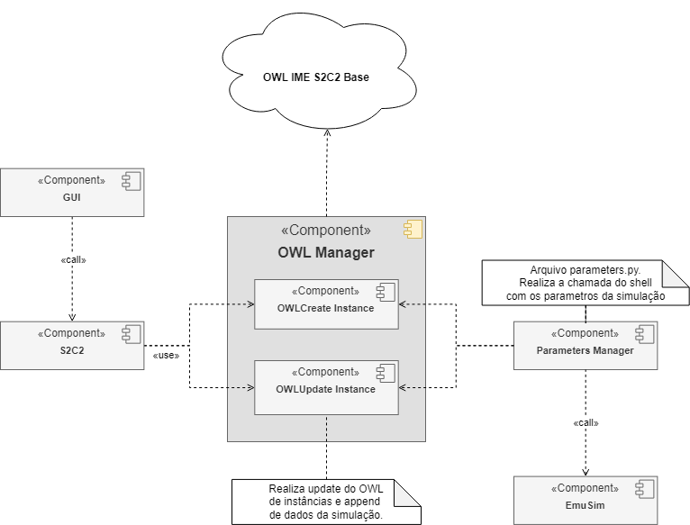
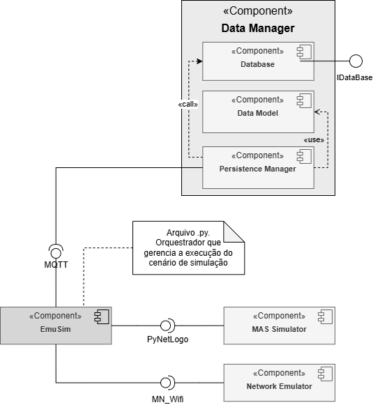
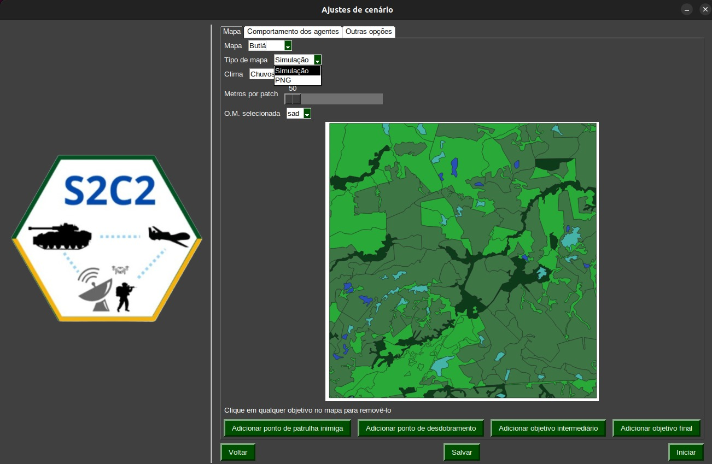
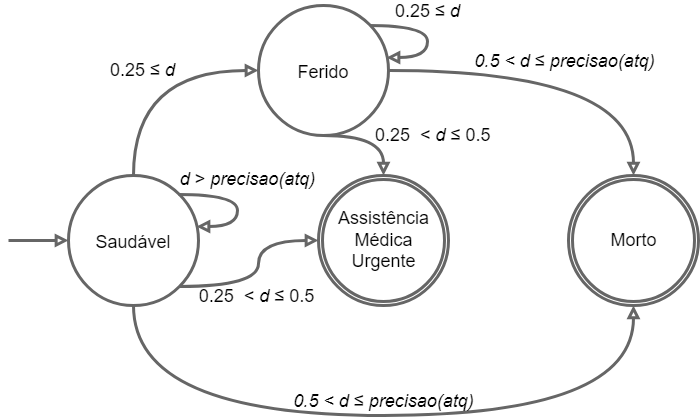
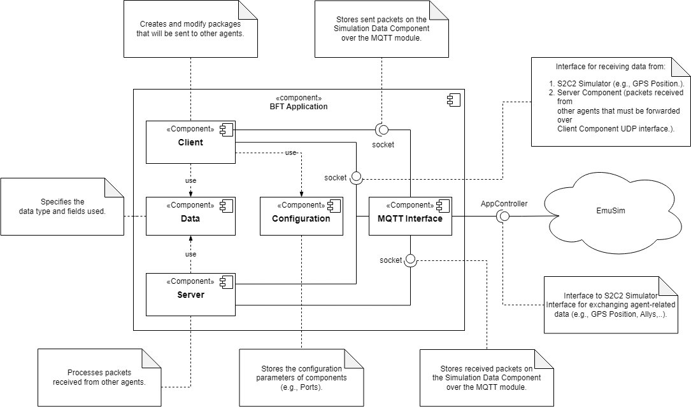
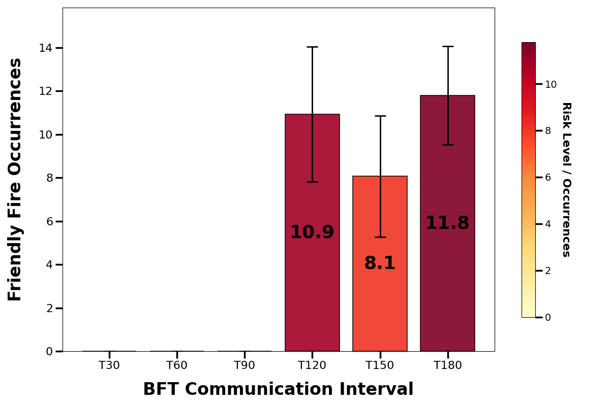

# INTRODUÇÃO {#sec:01}

O estudo de soluções para implementar uma rede de comunicação que
suporte as aplicações da Família de Aplicativos de Comando e Controle da
Força Terrestre (FAC2FTer) oferece diversas oportunidades de exploração
do espaço de projeto visando o desenvolvimento de protocolos eficientes
para comunicação de dados entre tropas em diferentes cenários. Estejam
elas em movimento, estacionadas ou em postos de comando tático, tais
soluções devem representar de maneira realista o objeto do problema,
como por exemplo, a movimentação ou o posicionamento das tropas em
cenário operacional.

O avanço das aplicações de comando e controle (C2) da FAC2FTer, aliado à
intenção do Exército Brasileiro de adquirir rádios táticos para diversas
unidades, destaca a necessidade de aprimorar protocolos e
funcionalidades. Esse esforço também integra o projeto de Rádio Definido
por Software (RDS), buscando fornecer às tropas capacidades avançadas de
comunicação. Simulações que reproduzem movimentos de tropas e o fluxo de
comunicação típico de operações militares são ferramentas essenciais
para o desenvolvimento e melhoria das aplicações C2, proporcionando
maior eficiência em operações terrestres.

Este documento apresenta a visão do Sistema de Simulação no projeto
Sistema de Sistemas de Comando e Controle (S2C2), detalhando os
componentes do modelo arquitetural desenvolvido e o manual de uso da
ferramenta criada. Portanto, seu foco está no papel dos componentes
relacionados à simulação da rede de comunicação e ao comportamento dos
agentes que representam as tropas no ambiente simulado que suportam as
aplicações C2. Além disso, o relatório apresenta o manual de uso da
ferramenta desenvolvida.

# VISÃO ARQUITETURAL {#sec:02}

Para simular um ambiente de campo de batalha realista, foi adotada uma
abordagem integrada entre um Simulador de Sistema Multiagente (MAS) e um
Emulador de Rede. Essa integração permitiu representar tanto os
comportamentos realistas das tropas quanto os problemas de
interoperabilidade que podem ocorrer nas comunicações nesse tipo de
cenário.

A estrutura geral da solução proposta é apresentada no diagrama de
componentes da Figura [1](#fig:1.arquitetura.s2c2){reference-type="ref"
reference="fig:1.arquitetura.s2c2"}. O diagrama ilustra os componentes
do sistema denominado *S2C2 EmuSim -- Configuração e Orquestração de
Simulação de Comando e Controle* e as relações estáticas compartilhadas
entre eles.

<figure id="fig:1.arquitetura.s2c2" data-latex-placement="!h!t">

 

Fonte: os autores.

<figcaption>EmuSim - Orquestrador e Configurador de Simulação de Comando
e Controle.</figcaption>
</figure>

Os componentes *Simulador MAS* e *Emulador de Rede* representam,
respectivamente, as ferramentas de simulação de sistemas multiagente e
de emulação de redes utilizadas nesta pesquisa. A execução coordenada e
sincronizada dessas duas ferramentas, em formato de co-simulação
[@gomes2018co], é essencial ao cenário militar estudado, sendo
orquestrada pelo componente *EmuSim*. A descrição objetiva desses
componentes é apresentada a seguir e detalhada na Seção 3 e suas
subseções.

- GUI: componente de inicialização do sistema. Comporta a interface de
  usuário.

- S2C2: componente lógico que intermedia as requisições da interface
  gráfica. Comporta as funções de criar e carregar cenários de simulação
  por meio de chamadas a outros componentes.

- OWL IME S2C2 Base: componente externo ao sistema, porém essencial ao
  seu funcionamento. Define um conjunto de regras da doutrina militar em
  formato OWL que são a base para os parâmetros aceitos pelas simulações
  executadas pelo sistema.

- OWL Manager: componente agregador das operações de OWL (Ontology Web
  Language), uma ontologia de domínio usada para representar entidades,
  indivíduos, categorias, inferências, atributos e relações, ao mesmo
  tempo em que permite verificar a consistência lógica entre as
  entidades simuladas e inferir regras e restrições do cenário.

  - OWL Create Instance: cria instâncias de dados OWL com cenários de
    simulação confingurados na interface do sistema. Um cenário de
    simulação define, por exemplo, o número de agentes em uma operação,
    a distribuição desses agentes em Organizações Militares (OM), se os
    agentes estão embarcados ou não em plataformas, entre outras
    especificações do cenário militar.

  - OWL Update Instance: atualiza as instâncias de dados OWL de um
    cenário de simulação previamente criado, de modo que o operador
    possa editar novos cenários a partir de cenários existentes.

- Parameters Manager: componente para a gerência dos parâmetros da
  simulação que não são específicos da doutrina definica pelo OWL (e.g.,
  seleção do mapa, exibir ou não exibir a interface gráfica durante a
  simulação, batch de simulação). É também responsável por realizar a
  chamada ao orquestrador da aplicação com os parâmetros da simulação.

- EmuSim: orquestrador responsável por gerenciar a execução do cenário
  de simulação. Este componente é essencialmente o núcleo do sistema.

- Simulador MAS: Simulador de Sistema Multiagente utilizado para simular
  tropas e o ambiente de campo de batalha do cenário militar analisado.
  Ele inclui algoritmos de tomada de decisão e busca de caminhos para
  escolher rotas e ações que levem ao objetivo.

- Emulador de Rede: Programa utilizado para emular a comunicação entre
  os agentes, bem como executar as aplicações de C2 e FAC2FTer,
  permitindo a troca de dados entre as tropas militares simuladas pelo
  Simulador MAS.

- Data Manager: componente agregador das operações de modelagem de dados
  e persistência de dados.

  - Database: banco de dados para armazenar os dados coletados de
    aplicações e estatísticas de rede dos cenários de simulação.

  - Data Model: componente para especificar o modelo de dados das
    aplicações que irão interagir com simulador.

  - Persistence Manager: componente para a gerência da persistência de
    dados da aplicação. Comunica-se com OWL Update instance para
    atualizar dados das instâncias da simulação e com Data Model.

- Grafana: API para observabilidade e visualização de métricas.
  Utilizado para exibir, na forma de gráficos, os indicadores das
  simulações executadas pelo sistema.

# MODELAGEM DO SISTEMA {#sec:03}

Nesta seção, são explorados com mais detalhes os componentes
apresentados na Seção 2, com o objetivo de detalhar seus principais
subcomponentes, conexões e funcionamento.

## Componentes GUI, S2C2 e OWL Manager {#subsec:3.1}

A inicialização da aplicação ocorre por meio do componente *GUI*, que
representa a interface de usuário do sistema. A partir dela, ocorrem as
solicitações e respostas às funcionalidades do sistema. O componente
*GUI* se comunica com o componente *S2C2*, que representa a parte lógica
da aplicação que interage com interface do usuário, a fim de disparar as
requisições solicitadas e prover para a interface o retorno dessas
operações.

O componente *OWL Manager*, destacado na Figura
[2](#fig:2.componentes.owl){reference-type="ref"
reference="fig:2.componentes.owl"} funciona como um agregador das
operações de OWL, uma linguagem semântica projetada para representar
conhecimentos sobre objetos e suas relações de forma detalhada
[@hitzler2009owl]. No contexto do simulador, as informações
proporcionadas pela *OWL IME S2C2 Base* compõem um componente externo à
aplicação, disponibilizado pelo Instituto Militar de Engenharia (IME),
no qual estão descritas as relações que a doutrina militar estabelecida
pelo Exército Brasileiro impõe sobre a construção de cenários militares
simulados. O que determina diretamente as configurações e ações que o
sistema executará.

<figure id="fig:2.componentes.owl" data-latex-placement="!h!t">

 

Fonte: os autores.

<figcaption>Componentes OWL e suas relações.</figcaption>
</figure>

Por exemplo, é do OWL que se obtém as informações que caracterizam um
agente do simulador multi-agente, como a identificação de uma unidade
como soldado ou comandante, ou a hierarquia de comunicação permitida
entre as unidades. Cabe ainda ao OWL a configuração de parâmetros fixos,
como o alcance dos dispositivos e, por consequência, a distância máxima
entre quaisquer dois soldados da simulação em que a comunicação é
possível.

Esta base de referência é utilizada para instanciar os nós da aplicação
por meio do componente *OWL Create Instance*, que converte os dados
oriundos da base OWL em parâmetros da aplicação por meio do componente
Parameters Manager. Sem estas informações, não é possível iniciar a
aplicação. As operações de atualização das instâncias de OWL são
realizadas pelo componente *OWL Update Instance*, sempre que há
modificações nos dados das instâncias da simulação.

Após a instanciação dos nós, os parâmetros da simulação são listados
pelo componente Parameters Manager, que permite ainda a personalização
dos mesmos dentro das restrições da doutrina militar, definidas em *OWL
IME S2C2 Base*. Por sua vez, todo ato de personalização destes
parâmetros ocasiona a atualização dos nós OWL e suas instâncias, por
meio de OWL Update Instance, ficando salvos para uma próxima execução.
Estes parâmetros incluem:

- Mapa: ambiente da operação militar.

- Organização Militar: formação das tropas (pelotão, esquadrão, equipe
  de combate, etc.).

- Tipo de Plataforma: tipo de tropa simulada (tropas a pé ou veículos
  blindados).

- Alcance dos Dispositivos de Comunicação: alcance funcional dos
  dispositivos de comunicação.

- Clima: condições climáticas para o cenário simulado (ensolarado ou
  chuvoso), podendo afetar a visão, velocidade ou comunicação das
  tropas.

- Tamanho do Lote: número de execuções da simulação.

- Algoritmo de Trajeto: priorização pelo caminho mais curto ou mais
  rápido.

- Posição Inicial das Tropas: posição inicial no cenário do mapa.

## Componente EmuSim e suas relações {#subsec:3.2}

O componente *EmuSim*, Figura [3](#fig:3.emusim){reference-type="ref"
reference="fig:3.emusim"}, orquestra o funcionamento geral do Sistema
S2C2. Consiste em um script Python que atua como uma ponte entre os
eventos acionados pelo uso do sistema e as aplicações externas
responsáveis por sua execução: o *Simulador MAS* (NetLogo) e o *Emulador
de Redes* (Mininet-WiFi). O NetLogo é uma plataforma de modelagem
multi-agente baseada em Java e Scala [@tisue1999center], enquanto o
Mininet-WiFi é um emulador de redes virtuais e conexões sem fio
[@lantz2010network].

<figure id="fig:3.emusim" data-latex-placement="!h!t">

 

Fonte: os autores.

<figcaption>Componente EmuSim e suas relações</figcaption>
</figure>

Ao executar um cenário, dados como número de agentes, sua velocidade e
outros parâmetros são providos a partir de *OWL IME S2C2 Base* via *OWL
Create Instance* por meio de *Parameters Manager*. Durante a execução de
um cenário, o *Simulador MAS*, NetLogo, gerencia aspectos operacionais
da simulação, como definir o número de nós (agentes), seus objetivos
primários, comportamentos em diferentes situações e ambiente. Já o
*Emulador de Redes*, Mininet-WiFi, provê os componentes necessários para
executar as aplicações de C2 em ambiente emulado, e os dispositivos de
rede necessários para suportar a troca de dados entre as aplicações.

O NetLogo é um ambiente de modelagem programável para múltiplos
agentes[@tisue1999center]. É uma plataforma robusta e de código aberto,
baseada na linguagem de programação Logo e implementada em Java e Scala.
O Mininet-WiFi é um emulador leve e de código aberto, desenvolvido em
Python, utilizado para criar redes virtuais realistas que operam com o
mesmo kernel, switches e código de aplicação do computador
[@lantz2010network], além de permitir conexões sem fio com pontos de
acesso, comunicação ad hoc e redes mesh [@fontes2015mininet].

Para sincronizar o NetLogo e o Mininet-WiFi, o EmuSim utiliza duas
interfaces: *PyNetLogo* e *MN_Wifi*. A *PyNetLogo* é uma biblioteca
Python que conecta o NetLogo a outros programas, permitindo a troca de
mensagens. A *MN_Wifi* envia comandos ao Mininet-WiFi para atualizar
dados das unidades emuladas e suas interfaces de rede.

Visando um cenário realista, cada nó de tropa é executado como uma
estação no Mininet-WiFi. O Mininet-WiFi utiliza namespaces do kernel do
Linux para criar ambientes de execução altamente isolados e leves em
cada nó (estações e Access Points). Isso garante que cada nó do
Mininet-WiFi possua sua própria pilha de rede, tabela de rotas,
endereços IP e conjunto de processos, completamente isolados tanto do
sistema operacional do host quanto dos demais nós. Essa abordagem é
crucial para simular cenários realistas onde as aplicações executadas em
um nó não interferem nas operações ou estados de rede de outros nós.

1.  **Isolamento Completo**: Cada nó opera em seu próprio namespace de
    rede, permitindo que as aplicações de C2 (e.g., BFT, Bravo) sejam
    executadas em um ambiente virtualmente separado, exatamente como se
    estivessem em máquinas físicas distintas, mas utilizando os recursos
    do host.

2.  **Vantagem de Leveza**: A vantagem em relação aos contêineres Docker
    é que os namespaces do Mininet-WiFi são mais leves e demandam menos
    sobrecarga computacional. Eles se concentram primariamente no
    isolamento do espaço de rede e dos processos, sem a necessidade de
    empacotamento completo do sistema operacional ou uso de camadas de
    abstração adicionais que os contêineres normalmente empregam. Isso
    resulta em simulações de rede mais rápidas e que consomem menos
    recursos.

Com essa abordagem, o EmuSim consegue executar o software C2 real em um
ambiente controlado, reproduzindo fielmente as condições de operação de
um hardware dedicado, mas com a flexibilidade e o controle de uma
simulação em rede.

As mensagens do NetLogo passam primeiro pelo EmuSim via *PyNetLogo*,
sendo então redirecionadas a nós emulados pelo Mininet-WiFi através da
*MN_Wifi*. Após o processamento, o resultado retorna ao NetLogo pelo
mesmo caminho, garantindo a integração e o funcionamento sincronizado.

Ao final da execuçao do cenário, os dados da simulação são armazenados
pelo componente Datamanager (e.g., dados de aplicação, métricas de
rede).

## Modelagem dos Mapas e Ambiente de Simulação {#subsec:3.3}

A representação fidedigna do ambiente operacional é um componente
crítico para a validade das simulações no S2C2. A modelagem dos mapas do
sistema utiliza como base arquivos topográficos reais, em formato
Shapefile (SHP), que detalham as características geográficas do terreno.

A inserção de um novo cenário no sistema começa pela obtenção dos dados
vetoriais brutos em repositórios oficiais, como o Banco de Dados
Geográficos do Exército (BDGEx). Esses dados precisam ser
pré-processados em um software com suporte a Sistemas de Informação
Geográfica (SIG).

Nesta pesquisa, utilizou-se o QGIS para filtrar e consolidar as camadas
do mapa original, renomeando-as de acordo com os cinco rótulos padrão
nativamente interpretados pelas simulações do NetLogo:

- `morros_intrans1`: Áreas alagadas intransponíveis;

- `morros_intrans2`: Terrenos intransponíveis;

- `morros_trans1`: Campo aberto;

- `morros_trans2`: Vegetação cultivada;

- `morros_trans3`: Relevo acidentado parcialmente transponível (morros).

A adição de novos mapas no sistema também exige:

- Dimensão real do terreno (em km): Informação fundamental para o
  cálculo da escala da grade, especificada no arquivo de texto
  `map_size.txt`;

- Imagem do mapa: Armazenada em formato PNG, utilizada no modo de
  visualização estática do cenário.

Por fim, a integração dos novos mapas à aplicação é realizada por meio
de um arquivo de configuração que carrega os vetores do cenário e define
os parâmetros de interpretação utilizados pelo NetLogo. Esse arquivo
também ajusta a grade de acordo com o tamanho dos *patches* do ambiente
de simulação e habilita a alternância entre a visualização do mapa de
simulação e a imagem estática, conforme a escolha do usuário.

Já a seleção dos cenários de simulação é feita por meio desse mesmo
sistema de configuração, que oferece duas modalidades: (1) geração
nativa da grade a partir dos Shapefiles, preservando a topografia
detalhada; ou (2) importação de uma imagem estática (PNG) como plano de
fundo. Ao adicionar um novo mapa, o sistema atualiza automaticamente o
arquivo de configuração, permitindo alternar entre o carregamento
vetorial ou a visualização da imagem.

Através do componente GUI, o usuário pode selecionar o cenário
geográfico desejado por meio de um menu *dropdown*, como mostrado na
Figura [4](#fig:dropdown){reference-type="ref"
reference="fig:dropdown"}. Atualmente, o sistema suporta os seguintes
mapas:

- Brasília

- Litoral de Pelotas e Rio Grande

- Butiá

<figure id="fig:dropdown" data-latex-placement="!h!t">

 

Fonte: os autores.

<figcaption>Dropdown para escolha dos mapas</figcaption>
</figure>

Após a seleção do mapa, as duas modalidades de execução mencionadas
anteriormente comportam-se da seguinte maneira (Figura
[5](#fig:mapa_netlogo){reference-type="ref"
reference="fig:mapa_netlogo"} e Figura
[6](#fig:mapa_png){reference-type="ref" reference="fig:mapa_png"}):

1.  **Mapa de Simulação (Padrão):** Os agentes (unidades) interagem
    diretamente com o grid de patches e suas propriedades topográficas.
    O movimento, a linha de visão e a propagação do sinal de comunicação
    são afetados pelas características de cada patch.

2.  **Visualização sobre Imagem (PNG):** Alternativamente, a simulação
    ocorre sobre a imagem estática do mapa (ex: imagem de satélite).
    Nesta modalidade, a representação visual abstrai a interação
    detalhada com a topografia do terreno, focando na movimentação sobre
    a imagem.

<figure id="fig:mapa_netlogo" data-latex-placement="!h!t">

 

Fonte: os autores.

<figcaption>Simulação com mapa gerado pelo Netlogo</figcaption>
</figure>

<figure id="fig:mapa_png" data-latex-placement="!h!t">

Fonte: os autores.

<figcaption>Simulação com mapa de Imagem PNG</figcaption>
</figure>

Um desafio computacional significativo em simulações de larga escala é a
**granularidade** do grid. Mapas extensos, quando representados por
patches de tamanho muito reduzido (e.g., 1$\times$`<!-- -->`{=html}1
metro), geram uma grade com elevado número de células. Isso aumenta
exponencialmente o custo computacional, impactando severamente o
desempenho do Simulador MAS, especialmente nos cálculos de rota do
algoritmo $A^{*}$.

Para mitigar este problema, o S2C2 implementa um mecanismo de ajuste de
granularidade. Na tela de configuração de cenário (detalhada no Apêndice
A), o usuário pode utilizar um controle deslizante (*slider*) para
definir a dimensão de cada patch (e.g., de 1$\times$`<!-- -->`{=html}1
metro até 50$\times$`<!-- -->`{=html}50 metros ou mais), como mostrado
na Figura [7](#fig:patch_slider){reference-type="ref"
reference="fig:patch_slider"}.

<figure id="fig:patch_slider" data-latex-placement="!h!t">

 

Fonte: os autores.

<figcaption>Slider de tamanho de patches</figcaption>
</figure>

Com base em dois parâmetros --- o tamanho real do mapa selecionado (em
metros) e o tamanho do patch definido pelo usuário ---, o sistema
realiza automaticamente um cálculo de proporcionalidade para determinar
as dimensões totais do grid (largura e altura em número de patches).

Esse resultado atualiza dinamicamente o arquivo de configuração do mapa,
garantindo que o simulador seja instanciado com uma grade otimizada para
o nível de granularidade desejado, permitindo assim que a simulação seja
executada com fluidez.

# MODELOS DE FLUXO DO SISTEMA {#sec:04}

A execução do sistema comporta uma série de modelos de fluxo, que vão
desde o fluxo da aplicação como um todo até a modelagem do comportamento
de agentes e da identificação de situações de fogo amigo. Estes
diferentes fluxos são apresentados nas subseções a seguir. Importante
frisar que, apesar de se mencionar ao longo desse capítulo a aplicação
C2 Blue Force Tracking (*BFT*), o sistema desenvolvido é genérico para
qualquer aplicação C2 e essa aplicação em especifico é usada apenas para
facilitar a compreensão de como o sistema funciona de forma geral.

## Modelagem do Fluxo da aplicação {#sec:04.1}

O modelo de fluxo da aplicação está detalhado na
Figura [8](#fig:8.simulatio.flow){reference-type="ref"
reference="fig:8.simulatio.flow"}, sendo detalhado a seguir.

1.  O usuário inicia o sistema utilizando o componente "GUI" e seleciona
    iniciar uma simulação, configurandoo os paramêtros que lhe são
    apresentados.

2.  O componente lógico S2C2 Menu valida a solicitação do usuário dentro
    das restrições estabelecidas pela doutrina militar, estipuladas
    pelos componentes de *OWL Manager* e solicita o disparo da simulação
    ao componente EmuSim.

3.  O "EmuSim" inicializa os componente *Simulador MAS*.

4.  O "EmuSim" inicializa os componente *Emulador de Redes*.

5.  O "EmuSim" instancia os componente *BFT* implementado dentro do
    componente *Emulador de Redes*.

6.  O sistema executa o loop da simulação até que o objetivo da mesma
    seja alcançado:

    1.  O *EmuSim* recupera do *Simulador MAS* as posições e dados dos
        nós da simulação por meio da interface interface PyNetLogo.

    2.  O *EmuSim* envia os dados coletados para o *Emulador de Redes*
        por meio da interface interface MN_Wifi.

    3.  O *EmuSim* envia os mesmos dados para a aplicação *BFT* por meio
        da interface interface MQTT.

    4.  A aplicação *BFT* devolve os dados processados para o componente
        *EmuSim*.

    5.  O componente *EmuSim* envia para o *Simulador SMA* os dados
        processados pelo *BFT*, que são usados para determinar e
        representar situações de fogo amigo na simulação.

    6.  Os dados resultantes são escritos pelo *EmuSim* no banco de
        dados.

7.  O *EmuSim* envia uma mensagem para interromper tanto o *Emulador de
    Redes*.

8.  O *EmuSim* envia uma mensagem para interromper o *Simulador SMA*,
    finalizando a simulação.

<figure id="fig:8.simulatio.flow" data-latex-placement="!ht">

 

Fonte: os autores.

<figcaption>Diagrama de sequência da aplicação para a execução de
cenários de simulação</figcaption>
</figure>

## Modelagem do Sistema Multiagente {#sec:04.2}

O cenário de simulação do sistema consiste em um mapa de batalha 2D de
tamanho $N \times M$, composto por uma grade $p_{x,y}$ de caminhos
possíveis, para o qual é possível personalizar a geografia do mapa, o
número de unidades aliadas e inimigas, a posição inicial e final para os
mesmos e também a localização de diferentes pontos de controle.

Um exemplo disso está ilustrado na Figura
[9](#fig:4.simulation){reference-type="ref"
reference="fig:4.simulation"}. Nela, trinta (30) agentes aliados são
representados por hexágonos azuis, que simbolizam soldados autônomos a
pé. Esses agentes devem atravessar o mapa, partindo da posição inicial
na base aliada (A), indicada por um quadrado branco próximo ao canto
inferior esquerdo do mesmo, até o destino (C), na base inimiga,
representada por um quadrado vermelho próximo ao canto superior direito
do mapa. Durante o trajeto, cada agente deve passar por pelo menos um
dos diferentes pontos de controle (B), representados por quadrados
amarelos ou laranjas, ao mesmo tempo em que confrontam dez (10) agentes
inimigos, simbolizados por hexágonos vermelhos, que se movem na direção
oposta, em direção à base aliada.

<figure id="fig:4.simulation" data-latex-placement="ht">

 

Fonte: os autores.

<figcaption>Simulação de ataque mostrando incidentes e baixas das
unidades.</figcaption>
</figure>

Para navegar pelo mapa, tanto unidades aliadas come inimigas navegam
utilizam o algoritmo A\*, que emprega uma função de avaliação, $f$, para
encontrar o caminho mais curto entre dois nós, minimizando a soma da
função de custo e dos valores heurísticos [@li2020path]. A equação
[\[a_star_function\]](#a_star_function){reference-type="ref"
reference="a_star_function"} define $f$ para qualquer agente $a_{i}$ na
simulação.

$$\begin{equation}
    f(a_{i}) = c_{a_{i}} + h_{a_{i}}
    \label{a_star_function}
\end{equation}$$

Por requisição dos stakeholders, a função de custo não leva em conta
nuances de decisão comportamental humana, pois o foco está em resolver
questões de comunicação, especialmente situações de fogo amigo (seção
[5.2](#sec:04.3){reference-type="ref" reference="sec:04.3"}). Portanto,
a equação [\[cost_function\]](#cost_function){reference-type="ref"
reference="cost_function"},que calcula a função de custo $c$ para
qualquer agente $a_{i}$ em direção ao objetivo $g$, tem como objetivo
encontrar a soma ótima para cada patch $p_{x,y}$ desde a posição atual
$pos$ do agente até o destino $g$, multiplicada pelo peso do tipo de
terreno $w_{p_{x,y}}$ para o patch atual. Os valores dos pesos
$w_{p_{x,y}}$ para cada patch $p_{x,y}$ do mapa são:

- Planícies: 1

- Áreas alagadas/terrenos de baixa elevação: 2

- Terrenos de média elevação: 3

- Terrenos intransponíveis (águas profunda ou terrenos elevados): 4

$$\begin{equation}
    c_{a_{i}}=\sum_{g}^{pos}\left ( p_{x,y} \times w_{p_{x,y}}\right )
    \label{cost_function}
\end{equation}$$

Por fim, o valor heurístico $h$ para o caminho de qualquer agente
$a_{i}$ até o seu objetivo é a distância Euclidiana entre sua posição
atual $(x_{a_{i}}, y_{a_{i}})$ e o patch do objetivo $g$, ou mais
precisamente $(x_{g}, y_{g})$. Assim,
$h(a_{i})=\sqrt{(x_{a_{i}} - x_{g})^2 + (y_{a_{i}} - y_{g})^2}$.

### Modelagem do Estado dos Agentes Sob Staque {#sec:04.1.1}

Ainda que as unidades aliadas e inimigas representadas por cada
simulação sejam inicialmente representadas como hexágonos de cor azul ou
vemelha, essas cores são dinamicamente alteradas pela simulação para
refletir o estado atual de cada agente, como é possível ver na
Figura [9](#fig:4.simulation){reference-type="ref"
reference="fig:4.simulation"} apresentada anteriormente.
Particularmente, referente a aliados e inimigos essas cores podem ser,
respectivamente:

- **Saudável**: azul/vermelho

- **Ferido**: roxo/rosa

- **Assistência médica urgente**: amarelo/laranja

- **Morto**: cinza/preto

Esses estados e suas devidas transições são definidos a partir de uma
Máquina de Estados Finitos (Finite State Machine, FSM), um tipo de
sistema estruturado que se caracteriza por um número finito de estados
interconectados por meio de transições. Cada estado abrange
comportamentos ou algoritmos específicos que são ativados ao entrar no
estado ou durante sua fase ativa. Os estados são representados como nós
conectados por transições, garantindo acessibilidade a todos os estados,
de forma direta ou indireta [@jagdale2021finite].

Entidades que operam dentro de uma FSM transitam de seu estado atual
$s_i$ para outro estado $s_j$ com base em condições predefinidas
associadas aquele estado. O cumprimento dessas condições aciona uma
transição para o estado conectado correspondente, permitindo mudanças
dinâmicas de estado dentro da FSM [@jagdale2021finite].

A FSM empregada para os agentes desta aplicação está ilustrada na Figura
[10](#fig:5.fsm){reference-type="ref" reference="fig:5.fsm"}, que
identifica o estado *Saudável* como o estado inicial dos agentes
enquanto que *Assistência médica urgente* e *Morto* são estados finais
deste fluxo. A adoção de *Assistência médica urgente* como estado final,
além de *Morto*, vai ao encontro da Convenção de Genebra, que protege
indivíduos nesse estado contra novos danos.

<figure id="fig:5.fsm" data-latex-placement="ht">

 

Fonte: os autores.

<figcaption>FSM para os estados dos agentes da aplicação sob
ataque.</figcaption>
</figure>

Agentes mudam de estado quando atacados. O estado resultante é
determinado por um valor aleatório $d$, usado para avaliar a dificuldade
do ataque. Se $d > 0.8$, nenhum ataque ocorre, semelhante a uma unidade
decidindo não engajar um alvo. No entanto, se $d \leq 0.8$, o atacante
dispara, acionando uma transição de estado.

A modelagem desta FSM assume que a probabilidade de acertar um ponto
específico do alvo diminui à medida que a letalidade do impacto aumenta.
Por exemplo, tiros direcionados a áreas altamente letais, como a cabeça,
são mais difíceis de atingir. Perspectiva que foi incorporada à FSM ao
estabelecer limites para que $d$ acione uma transição.

Esses limites incluem uma função $precisao$ relacionada ao ataque $atq$,
que tem como dois fatores principais o alcance da arma do atacante e a
distância em linha reta entre o atacante e o alvo. Função que é
construída de forma que $precisao(atq) \leq 0.8$.

A transição de estado resultante de um ataque $(d \leq 0.8)$ depende do
estado atual do agente e do valor aleatório de dificuldade sorteado para
$d$. Por exemplo, o estado inicial *Saudável* conta com as seguintes
possíveis transições:

- $d > precisao(atq)$: O ataque erra, e a unidade alvo permanece
  *Saudável*.

- $0.25 \leq d \leq precisao(atq)$: O ataque acerta, a unidade alvo
  permanece em combate, transita para o estado *Ferido* e tem sua
  mobilidade reduzida.

- $0.25 < d \leq 0.5$: O ataque é grave, a unidade alvo é forçada a
  evacuar e transita para o estado *Assistência médica urgente*.

- $0.5 < d \leq 0.8$: O ataque é crítico, a unidade alvo é abatida e
  transita para o estado *Morto*.

A quantidade de informação que uma unidade possui sobre outra influencia
diretamente a decisão de atacar. Por isso, a comunicação é vital para
soldados a pé. O reconhecimento visual permite identificar aliados sem
depender da rede, porém só é possível dentro de uma distância máxima em
linha reta; ainda assim, continua essencial. Falhas nesse reconhecimento
--- por limitação de alcance, condições ambientais ou erro de percepção
--- podem gerar incidentes de fogo amigo, que são discutidos na próxima
seção.

# APLICAÇÕES DE S2C2 {#sec:05}

Para analisar o desempenho do simulador, desenvolveram-se diferentes
aplicações de S2C2 ao longo do projeto. Estas aplicaçãoes e os
resultados obtidos a partir das mesmas são discutidas a seguir.

## Modelos de Dados da Aplicação {#subsec:3.3}

Para melhor organizar as informações geradas pela simulação, bem como,
para facilitar futuras consultas a dados e a execução em tempo real,
foram criados diferentes conjuntos de dados para a troca de informações
entre agentes do sistema, simulador e emulador. Estes conjuntos são
divididos em Mensagens, Posições e Colinas.

- Mensagens: registra tentativas de comunicação e comunicações
  bem-sucedidas.

- Posições: registra o log da trajetória seguida por cada unidade.

- Colinas: registra a presença de elevações do terreno (colinas) que
  possam interferir na comunicação entre pares de unidades durante a
  simulação.

### Posições

O conjunto de dados Posições identifica os agentes individuais do
sistema multiagentes do simulador, cada um representando uma unidade
militar. Estes dados são gerados e processados pelo NetLogo para
questões de deslocamento das unidades, e utilizados pelo Mininet Wi-fi
para avaliar as chances de sucesso ou falha de comunicações. Os
seguintes campos compõem o conjunto Posições.

- node: tipo inteiro. Indica o nó ao qual as informações se referem.

- x: tipo float. Indica a coordenada x da unidade referida no nó.

- y: tipo float. Indica a coordenada y da unidade referida no nó.

- tick: tipo inteiro. Indica o momento (em ticks) dos dados.

- round_id: tipo inteiro. Indica o número do ciclo atual.

### Colinas

O conjunto de dados Colinas identifica o nível de transposição de cada
patch individual do mapa da simulação, sendo um patch uma célula
individual que pode ser ocupada por um agente. Os dados do conjunto
impactam tanto o algoritmo de deslocamento dos agentes no NetLogo, como
o nível de sucesso de entrega do envio de comunicações de rádio entre as
unidades militares no Mininet Wi-fi. Os seguintes campos compõem o
conjunto Colinas.

- nodea: tipo inteiro. Indica um dos nós do par analisado.

- nodeb: tipo inteiro. Indica o outro nó do par analisado.

- hill: tipo inteiro. Indica o nível de interferência entre o par de
  nós.

- tick: tipo inteiro. Indica o momento (em ticks) das informações.

- round_id: tipo inteiro. Indica o número da rodada atual.

## Modelagem de ocorrências de Fogo Amigo {#sec:04.3}

A comunicação é um recurso vital para os soldados. O reconhecimento
visual permite que as unidades militares, dentro de uma distância reta
máxima, identifiquem aliados sem depender de comunicações por rede. No
entanto, além desse limite ou quando na presença de obstáculos visuais,
o uso de communicação por rede é essencial para identificar unidades
amigas.

Situações de fogo amigo ocorrem justamente quando uma unidade militar é
incapaz de identificar outra unidade como aliada e a ataca por engano.
Para monitorar e evitar esses incidentes, a aplicação desenvolvida
utiliza um sistema BFT, um tipo de sistema conhecido por empregar
dispositivos GPS para rastrear e exibir as posições de forças aliadas
(azuis) no campo de batalha. Esse sistema aprimora a consciência
situacional e facilita as comunicações de comando e controle entre
unidades dispersas [@sweeney2008blue; @chevli2006blue].

A eficácia da aplicação BFT depende de uma comunicação de rede robusta
para identificar aliados com precisão. Interrupções na rede,
frequentemente causadas por obstáculos no campo de batalha, como
terrenos elevados, podem gerar dados BFT incompletos ou a total perda da
informação, assim, aumentando o risco de fogo amigo. Equipes militares
geralmente preveem esses obstáculos por meio de missões de
reconhecimento de terreno, característica que reforça a escolha do
algoritmo A\* para a simulação do movimento das unidades. Para este
sistema, a aplicação BFT foi construída como um modulo dentro do
componente *Emulador de Redes*, no caso, o Mininet Wi-fi, sendo acionado
junto com o início da simulação de acordo com o fluxo do diagrama de
sequência da Figura [11](#fig:9.diagrama.bft){reference-type="ref"
reference="fig:9.diagrama.bft"}.

<figure id="fig:9.diagrama.bft" data-latex-placement="ht">

 

Fonte: os autores.

<figcaption>Diagrama de sequência da aplicação BFT.</figcaption>
</figure>

De acordo com o diagrama da aplicação BFT, cada nó $i$, que simula uma
unidade militar, possui uma aplicação cliente-servidor. A cada tick do
ambiente de simulação, o nó $i$ recebe uma mensagem do ambiente
ordenando que avance pelo mapa do cenário. Após receber essa mensagem, o
cliente do nó $i$ envia uma nova mensagem com seus dados de localização
para todos o nó $n$ da população de agentes $P$ próximo a ele, assumindo
que $\exists n \in P | n \neq i \wedge (0 \leq n < P)$. Igualmente, todo
nó $n$ da aplicação que recebe esta nova mensagem a reencaminha para
todo nó $m$ próximo a ele, de forma que
$\exists m \in P | m \neq i \wedge m \neq n \wedge (0 \leq m < P)$.

Em paralelo a isso, todo nó $i$ da simulação que recebe uma mensagem de
outro nó $k$ qualquer em sua aplicação servidor envia para sua interface
MQTT os dados de localização recebidos deste nó $k$, junto com seu
próprio identificador, a informação de data e hora do recebimento dessa
informação e o identificador do tick atual. Ao final, a interface MQTT
do nó $i$ devolve para o ambiente da aplicação os dados de localização
do nó $k$, que utiliza essas informações para atualizar o cenário da
simulação.

O modelo BFT construído assume que, no início da simulação, os agentes
aliados compartilham informações mútuas, permitindo a troca de dados
BFT, que é ilustrada pelas linhas brancas na
Figura [12](#fig:6.simulation.lines){reference-type="ref"
reference="fig:6.simulation.lines"}. No entanto, obstáculos no terreno,
assim como interrupções na rede, podem levar a perda parcial de
comunicação, de forma que apenas um dos agentes conectados possui dados
BFT sobre o outro (ilustrado pela linha laranja ligando os agentes em
questão), ou a perda completa de comunicação (reresentada pela ausência
de linha conectando os agentes).

<figure id="fig:6.simulation.lines" data-latex-placement="!h!t">

 

Fonte: os autores.

<figcaption>Monitoramento de comunicação entre unidades
aliadas.</figcaption>
</figure>

Unidades aliadas e inimigas disparam automaticamente contra unidades não
identificadas dentro de seu campo de visão. Além do campo de visão ---
em formato de cone --- a precisão do disparo também considera o alcance
efetivo da arma portada pelo agente. A cada segundo, o MAS escaneia o
cenário de batalha, iterando sobre os agentes e registrando, para cada
um, todas as unidades dentro do seu campo de visão que atendem às
condições de ataque e não se encontram em um estado final da FSM.

Por outro lado, conforme requisitado pelos stakeholders, as unidades
inimigas seguem um comportamento de ataque simplificado: elas nunca
causam fogo amigo e sempre disparam contra unidades aliadas dentro do
seu alcance de precisão.

Isso contrasta com as unidades aliadas, que seguem um processo decisório
mais complexo, detalhado no diagrama de atividades [@OMG2017] da
Figura [13](#fig:7.friendly.fire){reference-type="ref"
reference="fig:7.friendly.fire"}. Esse modelo trata cada agente $a_{i}$
como um possível atacante direcionado a outros agentes. Contudo, tanto
unidades inimigas quanto aliadas estão sujeitas a erros de disparo.

<figure id="fig:7.friendly.fire" data-latex-placement="!h!t">

 

Fonte: os autores.

<figcaption>Fluxo de ataque e fogo amigo entre unidades
aliadas.</figcaption>
</figure>

A confirmação de um alvo segue condições específicas --- apresentadas no
diagrama da Figura [13](#fig:7.friendly.fire){reference-type="ref"
reference="fig:7.friendly.fire"} e listadas a seguir. Esse processo é
repetido para cada agente aliado com status válido na simulação,
considerando todas as combinações possíveis entre agentes atacante e
alvo, até a conclusão da simulação.

- Atacante e alvo não se encontram em um estado final.

- A distância em linha reta entre o atacante e o alvo está fora da
  distância de "reconhecimento visual", exigindo o feedback da aplicação
  BFT para identificação mútua.

- O atacante não recebeu da rede BFT comunicação de retorno do alvo.

- O atacante decidiu atirar e tem o alvo dentro do campo de visão e
  alcance da arma $(0<d \leq \text{min}(0.8, precisao(atq)))$.

- A unidade atacante respeita um atraso de, pelo menos, 6 segundos entre
  a visualização do alvo e o disparo. Tempo requisitado pelos
  stakeholders com base nos tempos médios para a tomada de decisão de
  disparo por soldados.

- A arma está pronta para disparar, sem restrições em vigor, como o
  tempo entre os disparos ou necessidade de recarga.

Quando todas as condições são atendidas, o atacante realiza o disparo.
Se tanto o atacante quanto o alvo forem unidades aliadas,
independentemente de o tiro acertar, o algoritmo incrementa a contagem
de "fogo amigo". Caso o alvo seja inimigo, a contagem de "inimigo
atacado" é aumentada.

## Blue Force Tracking {#subsec:5.3}

Para analisar o desempenho do simulador, conforme descrito na Seção 4.3,
foi criada a aplicação **Blue Force Tracking (BFT)**. Essa aplicação é
executada em cada nó controlado pelo **Emulador de Rede**. Em cada nó
rodam os módulos `Client` e `Server` do BFT, que utilizam a pilha de
rede isolada do respectivo *namespace* --- ou seja, o conjunto de
protocolos e interfaces de rede independentes daquele nó --- para se
comunicarem. Nesta seção, são apresentados os principais componentes do
BFT, ilustrados na Figura [14](#fig:a.diagrama.bft){reference-type="ref"
reference="fig:a.diagrama.bft"}.

<figure id="fig:a.diagrama.bft" data-latex-placement="ht">

 

Fonte: os autores.

<figcaption>Diagrama de Componentes da Aplicação Blue Force
Tracking.</figcaption>
</figure>

### MQTT Interface

O componente MQTT interface fornece uma interface para a troca de dados
entre o orquestrador da simulação e a aplicação BFT que executa dentro
de cada agente simulados do cenário de campo de batalha.

### Client

O componente Client define a interface de envio de dados da aplicação
através de pacotes UDP.

### Server

O componente Server define a inferface para recebimento de dados da
aplicação oriundo de outros agentes, pacotes UDP.

### Configuration

O componente Configuration contém informações de configuração da
aplicação, como o as portas utilizadas pelos componentes Client e
Server, as portas utilizadas para o MQTT, entre outras configuraçõs de
rede. Também no componente Configuration é especificado o ttl, um
inteiro que define o número de vezes que uma mensagem recebida por um
agente será retransmitida para os demais agentes no seu alcance de
comunicação. Este parâmetro visa ampliar a área de cobertura do BFT.

### Data

O componente Data define o modelo de dados da aplicação BFT, composto
por:

- source_ip: endereço de IP de origem;

- receiver_ip: endereço IP de destino;

- tick_sent: inteiro indicando o momento (em ticks) a que as informações
  se referem.

- position_x: float indicando a coordenada $x$ do agente.

- position_y: float indicando a coordenada $y$ do agente.

O diagrama representado na Figura [15](#fig:b.bft){reference-type="ref"
reference="fig:b.bft"} apresenta a comunicação da aplicação BFT com o
simulador S2C2 através das interfaces AppController e IDatabase, também
representadas na
Figura [1](#fig:1.arquitetura.s2c2){reference-type="ref"
reference="fig:1.arquitetura.s2c2"}.

<figure id="fig:b.bft" data-latex-placement="ht">

 

Fonte: os autores.

<figcaption>Interação do BFT com Simulador S2C2.</figcaption>
</figure>

Durante a simulação, a aplicação BFT troca mensagens de controle com o
orquestrador da simulação, o EmuSim, e armazena as mensagems trocadas no
banco de dados através da interface IDataBase. No final da simulação, a
aplicação BFT gera um relatório contendo as estatísticas de fogo amigo
do cenário de simulação executado, de modo a validar o impacto das
alterações no cenário de simulação no contexto do fogo amigo.

# CENÁRIOS DE TESTES E RESULTADOS {#sec:06}

Ao longo do projeto, diferentes cenários de simulação foram
desenvolvidos para representar as diversas necessidades apresentadas
pelas Forças Armadas. A
Figura [16](#fig:10b.simulation){reference-type="ref"
reference="fig:10b.simulation"} e a
Figura [17](#fig:10c.simulation){reference-type="ref"
reference="fig:10c.simulation"} mostram os computadores do laboratório
S2C2 executando alguns desses diferentes cenários.

<figure id="fig:10b.simulation" data-latex-placement="!ht">

 

Fonte: os autores.

<figcaption>Diferentes cenários de simulação em execução no laboratório
S2C2</figcaption>
</figure>

<figure id="fig:10c.simulation" data-latex-placement="!ht">

Fonte: os autores.

<figcaption>Simulação de ataque executando no simulador.</figcaption>
</figure>

A seguir, são detalhados dois cenários que melhor ilustram o progresso
obtido no desenvolvimento das simulações. Ambos compartilham as mesmas
características de mapa, tropas aliadas, parâmetros de comunicação e
condições climáticas, diferindo apenas quanto à presença ou ausência de
inimigos. Na sequência, é apresentado um comparativo entre as duas
propostas, a fim de compreender melhor como essa diferença afeta as
ocorrências de fogo amigo entre unidades aliadas.

## Cenário de Simulação BFT 01: Ausência de inimigos

O cenário de simulação analisado é apresentado na
Figura [18](#fig:10.simulation){reference-type="ref"
reference="fig:10.simulation"}. Esse cenário consiste em 21 unidades
aliadas de soldados a pé, divididas em três grupos de combate.

<figure id="fig:10.simulation" data-latex-placement="!ht">

Fonte: os autores.

<figcaption>Simulação de ataque sob análise.</figcaption>
</figure>

Para alcançar resultados estatisticamente consistentes entre as
configurações, foram realizadas 43 execuções de simulação por intervalo.
Este experimento foi conduzido com seis durações distintas de
comunicação --- 30, 60, 90, 120, 150 e 180 *ticks* (representando
aproximadamente um segundo do mundo real por *tick*) --- a fim de
explorar as complexidades da comunicação. Além disso, o período de
validade de cada mensagem foi definido como o dobro do respectivo
intervalo de comunicação (por exemplo, para um intervalo de comunicação
de 60 segundos, uma mensagem recebida por um aliado permanece válida por
120 segundos).

Para isolar melhor os resultados de fogo amigo do BFT, não foram
incluídas unidades inimigas para a execução desta primeira análise. Pelo
mesmo motivo, a simulação foi executada sob condições climáticas claras,
sem considerar falhas de equipamento ou recursos de guerra eletrônica.

As unidades aliadas navegam continuamente em direção aos destinos
designados, passando pelos pontos intermediários indicados pela cor do
círculo que destaca cada unidade na
Figura [18](#fig:10.simulation){reference-type="ref"
reference="fig:10.simulation"}, até alcançar o destino destacado em
amarelo. À medida que as tropas se deslocam pelo campo, as forças
aliadas podem passar pelas zonas de linha de visão, alcance de
comunicação e alcance de disparo. Elas classificam como aliados tanto as
unidades corretamente identificadas dentro de seu campo de visão quanto
aquelas que recebem com sucesso as informações transmitidas dentro do
período de validade. Qualquer unidade que não atenda a um desses
critérios é classificada como inimiga --- mesmo que o cenário simulado
não inclua entidades inimigas.

Entretanto, essa classificação permanece suscetível a mudanças
topológicas que podem afetar o campo de visão ou o alcance de ataque.
Tais mudanças também podem influenciar a taxa de sucesso na entrega de
mensagens pela rede, fator que, juntamente com a presença de unidades
inimigas e condições climáticas diversas, será abordado em futuros
cenários de simulação, a fim de reduzir a diferença entre simulação e
realidade.

<figure id="fig:11.ff_progression" data-latex-placement="h!t!">

<figcaption>Evolução da taxa de fogo amigo com a melhoria na comunicação
do BFT.</figcaption>
</figure>

Os resultados dos conjuntos de simulação nos seis diferentes intervalos
de comunicação são mostrados no gráfico da
Figura [19](#fig:11.ff_progression){reference-type="ref"
reference="fig:11.ff_progression"}. Dependendo da gravidade do ataque,
as unidades atingidas podem transitar entre estados anteriormente
definidos na FSM da Figura [10](#fig:5.fsm){reference-type="ref"
reference="fig:5.fsm"}, como por exemplo, como "Ferido" ou "Assistência
médica urgente".

Como mostra o gráfico, os dados do BFT contribuem significativamente
para a redução do fogo amigo em comparação com cenários sem seu uso. A
comunicação em intervalos mais curtos melhora ainda mais a prevenção de
fogo amigo em relação a intervalos mais longos. No entanto, embora o BFT
seja eficaz para intervalos curtos, o aumento do intervalo não produz
uma tendência linear, como evidenciado pelos intervalos de comunicação
T120, T150 e T180 na
Figura [19](#fig:11.ff_progression){reference-type="ref"
reference="fig:11.ff_progression"}.

Apesar da tendência geral de que intervalos maiores apresentem maior
incidência média de fogo amigo, o intervalo T150 registrou uma média
inferior à do intervalo imediatamente anterior (T120). Supõe-se que esse
resultado tenha ocorrido porque, dentro do cenário de movimentação
mostrado na Figura [18](#fig:10.simulation){reference-type="ref"
reference="fig:10.simulation"}, um pequeno número de unidades aliadas
provavelmente atingiu o limite de comunicação com outras unidades entre
os *ticks* 0 e 119.

Por outro lado, a partir de 150 *ticks*, houve um número maior de
unidades aliadas dentro do alcance de comunicação, resultando em um
aumento na troca de mensagens e, consequentemente, em uma redução nos
incidentes de fogo amigo, uma vez que mais unidades aliadas
estabeleceram comunicações bem-sucedidas antes de entrarem no raio de
tiro ou de visão de outras unidades.

## Cenário de Simulação BFT 02: Presença de inimigos

## Cenário de Simulação GCB

O cenário de simulação com o GCB foi executado em conjunto com o cenário
de simulação BFT. Essa integração teve como objetivo permitir a troca de
mensagens entre os sistemas, de modo que os dados fornecidos pela
aplicação pudessem apoiar a tomada de decisão do comandante.

Nesse contexto, o GCB atua em complemento às características já
descritas para um cenário de simulação executado na aplicação. Assim,
após a seleção do cenário, a parametrização de suas características e o
início da execução, as estações GCB são inicializadas nos nós simulados.

As Figuras [20](#fig:S2C2-CGB01){reference-type="ref"
reference="fig:S2C2-CGB01"}, [21](#fig:S2C2-CGB02){reference-type="ref"
reference="fig:S2C2-CGB02"} e [22](#fig:S2C2-CGB03){reference-type="ref"
reference="fig:S2C2-CGB03"} ilustram essa integração. A Figura
[20](#fig:S2C2-CGB01){reference-type="ref" reference="fig:S2C2-CGB01"}
mostra o cenário de simulação em execução, com os respectivos agentes em
azul, os logs das estações GCB exibidos no prompt de comando e o mapa da
aplicação GCB em operação. Neste cenário, cinco estações são simuladas.

<figure id="fig:S2C2-CGB01" data-latex-placement="!ht">

<figcaption>Inicialização das estações GCB com o cenário de
simulação.</figcaption>
</figure>

A Figura [21](#fig:S2C2-CGB02){reference-type="ref"
reference="fig:S2C2-CGB02"} apresenta a inserção de um novo nó no campo
de batalha, que é automaticamente identificado como inimigo pelos demais
devido à ausência de informações sobre ele.

<figure id="fig:S2C2-CGB02" data-latex-placement="!ht">

<figcaption>Inserção de novo nó no campo de batalha e resposta dos
outros nós da simulação.</figcaption>
</figure>

O sucesso da comunicação faz com que o novo elemento seja reconhecido
como parte do mesmo grupo de batalha, sendo inserido de forma apropriada
na hierarquia de comando, conforme ilustrado na Figura
[22](#fig:S2C2-CGB03){reference-type="ref" reference="fig:S2C2-CGB03"}.

<figure id="fig:S2C2-CGB03" data-latex-placement="!ht">

<figcaption>Troca de mensagens bem-sucedida entre os nós.</figcaption>
</figure>

## Cenário de Simulação BRAVO (Extensão Projeto S2C2)

# PUBLICAÇÕES GERADAS {#sec:07}

- CARVALHO, Leonardo Filipe Batista Silva de; DE SOUZA, Vitor Simon;
  BONATTO, Alisson Nunes; PEREZ, Thales Junqueira Albergaria Moraes; DE
  FREITAS, Edison Pignaton; BARONE, Dante Augusto Couto; ZIBETTI,
  Guilherme Rotth; DOS ANJOS, Julio C. S.; DE ARAUJO FERNANDES, Ricardo
  Queiroz. Multi-Agent Systems Modeling of Command and Control Systems:
  A Metrics-Driven Approach to Simulator Evaluation and Co-Simulation.
  Journal of Simulation, \[S. l.\], no prelo, 2025. DOI:
  10.1080/17477778.2025.2584542.

- GOMES, João Eduardo Costa; EHLERT, Ricardo Rodrigues; BOESCHE, Rodrigo
  Murillo; SANTOS DE LIMA, Vinicius; STOCCHERO, Jorgito Matiuzzi;
  BARONE, Dante Augusto Couto; WICKBOLDT, Juliano Araujo; FREITAS,
  Edison Pignaton de; ANJOS, Julio C. S. dos; ARAUJO FERNANDES, Ricardo
  Queiroz de. Surveying emerging network approaches for military command
  and control systems. ACM Computing Surveys, v. 56, p. 1--38, 2024.

- CARVALHO, Leonardo Filipe Batista Silva de; SOUZA, Vitor Simon de;
  BONATTO, Alisson Nunes; PEREZ, Thales Junqueira Albergaria Moraes;
  FREITAS, Edison Pignaton de; BARONE, Dante Augusto Couto; ZIBETTI,
  Guilherme Rotth; ANJOS, Julio C. S. dos; ARAUJO FERNANDES, Ricardo
  Queiroz de. A multi-agent system approach for Blue Force Tracking C2
  application modeling. In: Lecture Notes in Networks and Systems. 1.
  ed. Cham: Springer Nature Switzerland, 2024. v. 2, p. 161--181.

- BARONE, Dante A. C. et al. Integrated multi-agent system simulator and
  network emulator framework to realistically exercise networked command
  and control application scenarios. In: INTERNATIONAL CONFERENCE ON
  SIMULATION AND MODELING METHODOLOGIES, TECHNOLOGIES AND APPLICATIONS,
  2023, Cham. Proceedings\... Cham: Springer Nature
  Switzerland, 2023. p. 9--28.

- BARONE, Dante Augusto Couto; WICKBOLDT, Juliano Araujo; CAVALCANTI,
  Maria Cristina Rosa; MOURA, David; TESOLIN, Julio Cesar Costa; DEMORI,
  André Marques; ANJOS, Julio C. dos; CARVALHO, Leonardo Filipe Batista
  Silva de; GOMES, João Eduardo Costa; FREITAS, Edison Pignaton de.
  Integrating a multi-agent system simulator and a network emulator to
  realistically exercise military network scenarios. In: INTERNATIONAL
  CONFERENCE ON SIMULATION AND MODELING METHODOLOGIES, TECHNOLOGIES AND
  APPLICATIONS (SIMULTECH 2023), 13., 2023, Roma. Proceedings\...
  Roma, 2023. p. 194--201.

- DEMORI, André; TESOLIN, Julio; MOURA, David; GOMES, João; PEDROSO,
  Gabriel; CARVALHO, Leonardo Silva de; FREITAS, Edison Pignaton de;
  CAVALCANTI, Maria. A semantic web approach for military operation
  scenarios development for simulation. In: INTERNATIONAL CONFERENCE ON
  DATA SCIENCE, TECHNOLOGY AND APPLICATIONS, 12., 2023, Rome.
  Proceedings\... Rome, 2023. p. 390.

# CONSIDERAÇÕES FINAIS {#sec:conclusion}

Este relatório apresenta o simulador desenvolvido no projeto S2C2,
visando melhorar o processo de desenvolvimento de sistema e aplicativos
de C2. O simulador desenvolvido oferece um ambiente que possibilita a
execução de exercícios militares a partir da abordagem de co-simulação,
permitindo testar protocolos de comunicação e sistemas táticos em
ambientes simulados.

Além do simulador apresentado, também foram desenvolvidas as aplicações
indicadas na Seção [5](#sec:05){reference-type="ref"
reference="sec:05"}, todas, visando a diminuição dos incidentes de
fratricídio nos cenários de campo de batalha. Essas aplicações,
constituiem os recursos que permitiram a restagem das *features*
implementadas no simulador, de modo a demonstrar sua aplicabilidade ao
executar aplicações que fornecem métricas relevantes para o contexto
militar. Portanto, destacam-se como principais contribuições deste
trabalho:

- Simulador S2C2: Um simulador baseado no paradigma de co-simulação que
  permite a integração com sistemas táticos para a realização de
  exercícios militares em ambientes simulados;

- Adequação à doutrina: Conforme exposto na
  subseção [4.2](#sec:04.2){reference-type="ref" reference="sec:04.2"} e
  [5.2](#sec:04.3){reference-type="ref" reference="sec:04.3"}, o sistema
  desenvolvido buscou representar com maior fidelidade a doutrina
  militar, desenvolvendo e implementando comportamentos relacionados à
  exercícios e operações militares;

- Validação com métricas de negócio: De modo a observar o impacto que
  diferentes parâmetros de configuração possam ter no sucesso da
  operação, foi desenvolvida a aplicação BFT, que fornece ao agente
  simulado ciência dos aliados no campo de batalha, visando que a tomada
  de decisão de tiro esteja apoiada em aplicações de C2.

Como trabalhos futuros, pretende-se expandir as capacidades do simulador
para interagir com a Família de Aplicativos de Comando e Controle da
Força Terrestre (FAC2FTer), bem como criar cenários de simulação para
apoiar as equipes de desenvolvimento de aplicativos de C2, com objetivo
de melhorar os processos de desenvolvimento, testes e homologação da
FAC2FTer e demais aplicativos C2.

Além disso, pretende-se adaptar a aplicação **Blue Force Tracking
(BFT)** --- já desenvolvida para análise de desempenho do simulador,
conforme descrito na Seção [5.3](#subsec:5.3){reference-type="ref"
reference="subsec:5.3"} --- para ser executada em nós-contêiner
controlados pelo **Emulador de Rede**. Nessa proposta, cada contêiner
docker deverá instanciar os módulos `Client` e `Server` do BFT,
utilizando a pilha de rede isolada do respectivo *namespace* --- ou
seja, o conjunto de protocolos e interfaces de rede independentes
daquele contêiner --- para realizar a comunicação.

Por fim, o Apêndice [\[appen:a\]](#appen:a){reference-type="ref"
reference="appen:a"} contém o manual de operação do simulador S2C2, e o
Apêndice [\[appen:b\]](#appen:b){reference-type="ref"
reference="appen:b"} apresenta o relatório de um cenário de simulação
executando o BFT.
